# AI Keyboard — Prompts at Your Fingertips

<div id="top"></div>

<div align="center">


[](https://opensource.org/license/apache-2.0)   

[简体中文](README_zh.md) | [English](README.md) 

</div>

---

## AI Keyboard User Guide

### These 136 Prompts Will Transform How You Prompt

**Typing prompts into the input box is very time-consuming.**

**To improve the efficiency of interacting with AI,**

**I devised an AI Keyboard**:

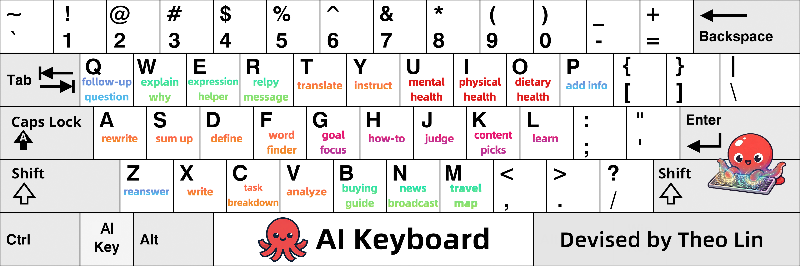

I wrote 136 prompts for the 26 letter keys on a keyboard, which are commonly used in work and daily life.

**You can set them as preset instructions for AI tools, or send them directly in the chat**.

By doing so, letter keys like <kbd>a</kbd>, <kbd>s</kbd>, <kbd>d</kbd> become shortcuts; you can simply type the corresponding shortcut to use the prompt.

> Tips: This README includes the 136 prompts and a detailed user guide. If you find it helpful, consider starring this repository for future reference.

<div id="toc"></div>

Here is an outline for this AI Keyboard User Guide. After reviewing it, you can start reading from the sections you need.

<details open>

<summary>Outline</summary>

<br>

[**Chapter 1**: The five functional zones and visuals of AI Keyboard.](#chapter-1-introduction-to-ai-keyboard)

[**Chapter 2**: The anatomy of AI Keyboard, including 136 prompts.](#chapter-2-the-anatomy-of-ai-keyboard)

[**Chapter 3**: AI Keyboard's usage guides and instructions for setting new AI Keys.](#chapter-3-user-guide)

[**Chapter 4**: Tips for remembering each key's prompts.](#chapter-4-how-to-remember-each-keys-prompts)

[**Chapter 5**: My motivation and sources of inspiration.](#chapter-5-motivation-and-inspiration)

</details>

<details open>

<summary><b>Click to hide or show the User Guide</b></summary>

## Chapter 1 Introduction to AI Keyboard

### 1.1 Five Functional Zones of AI Keyboard

<p>
 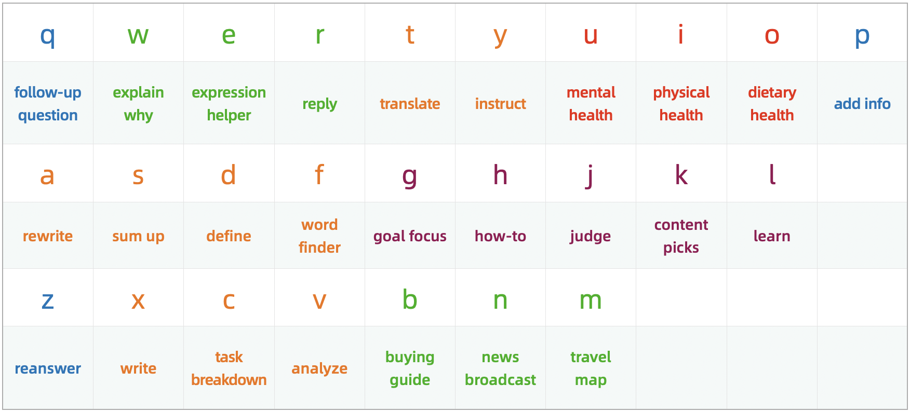
</p>

For better usability and recall, **I divided a keyboard into five functional zones**, and then wrote prompts with similar usage scenarios for the keys in each zone.

As shown in the table above, the orange area is **Office Zone**, the green area is **Daily Life Zone**, the red area is **Health Zone**, the deep purplish red area is **Self-Improvement Zone** and the blue area is **Q&A Assistant Zone**.

The "explain why", "rewrite" and "reanswer" in this functional zoning table are brief descriptions of each key.

For all 136 prompts and corresponding shortcuts, please refer to Chapter 2.

---

### 1.2 AI Keyboard Visuals

Here is the logo for AI Keyboard, a small red octopus: 

<div align="center">
 
</div>

So you can also call it "**OctoBoard**".

Its key visual features an octopus casting magic on a keyboard, symbolizing "**prompts at your fingertips.**"

<div align="center">
 
</div>

<p align="right">
  <a href="#toc">
    
  </a>
</p>

---

## Chapter 2 The Anatomy of AI Keyboard

AI Keyboard mainly consists of 136 prompts.

To use it, you need to set the prompts as preset instructions for AI tools.

You can also send them directly in the chat, or use the native text replacement feature in your input method to set them as custom phrases.

> Tips: In addition to setting the 26 letters as shortcuts, I also defined some others. I'm sure you'll be able to spot the pattern from the shortcuts before each prompt.

<details open>

<summary><b>Click to hide or show the prompts</b></summary>

<br>

**The prompts are as follows**:

**<ai_keyboard>**

**\<metadata>**

Name: AI Keyboard

Version: General v2.0

Author: Theo Lin

**\</metadata>**

**<system_rules>**

In this conversation, all your subsequent responses must strictly follow the rules below:

I've configured letters, numbers, words as well as combinations of letters paired with numbers or symbols as shortcuts for prompts.

Please insert the content provided after the shortcut into the [] and use the result as the prompt I'm sending you.

If my input consists solely of a shortcut without any additional content and the prompt corresponding to this shortcut contains [], please prioritize checking whether there is a file uploaded in the current message: if so, fill the content of the file into the []; if not, then default to filling your response from the previous round of dialogue into the [].

If there are two [] in the prompt associated with a shortcut, I will use / to separate my input; please put the content before the / into the first [] and the content after the / into the second.

If I use multiple shortcuts, I will also use / to separate them.

The shortcuts and corresponding prompts are as follows:

**q**: Explain or interpret the following from the above response in detail: [].

**qq**: When I feel like asking you [], what might I really be asking?

**qz**: Improve this prompt, then execute it: [].

——

**w**: Why []? Please explain it in plain English.

**ww**: Why []? Please provide a detailed explanation.

**wq**: Use the 5 Whys method to identify the root cause of [].

**wz**: Use brainstorming to identify the causes of [].

**w1**: Use first principles to explain why [].

——

**e**: Here is the meaning or feeling I want to convey: []. Please suggest some appropriate words and expressions.

**ee**: My purpose is as follows: []. Please give me some suggested phrasing, communication tips, and conversation templates.

**eq**: [], which phrasing is better? Please give me a few more options.

**ez**: Use appropriate methods of argumentation and supporting evidence to argue for the following point: [].

——

**r**: Reply to the following message in an emotionally intelligent way: [].

**rr**: Reply to the following message in a way that provides emotional value: [].

**rq**: My purpose is as follows: []. So how should I reply to the following message: [].

**rz**: I want to ask [] some questions to []. Please give me some suggested questions and include questioning tips.

**rp**: Act as [] and chat with me.

——

**t**: Translate the following into English: [].

**tt**: Translate the following into Chinese: [].

**tq**: Analyze the subtext or implications of the following: [].

**tz**: Translate the following into English and generate a summary: [].

——

**y**: The work I'm going to do is as follows: []. Please give me some prompts and thinking exercises to help expand my perspective and improve my efficiency.

**yy**: Provide teaching methods for the following instructional content: []. The target audience is [].

**yq**: Guide me to think and analyze the following through questioning: []. Don't give me the answer directly. Instead, start by asking me the first question.

**yz**: How to help [] cultivate or learn []?

——

**u**: You are my therapist now. I []. Please provide me with psychological counseling or emotional support.

**uu**: The things that are mentally draining me are as follows: []. What should I do?

**uq**: I want to []. But due to inner conflict and psychological barriers, I haven't been able to take action for a long time. Please give me some encouragement and guidance.

**uz**: I feel mentally exhausted because []. What should I do?

——

**i**: I or my []. Please analyze the causes from physiological, psychological and other relevant perspectives.

**ii**: I []. To avoid any health risks, what preparations should I make beforehand? And what should I watch out for during the process?

**iq**: Share some daily habits that are beneficial for physical health and brain agility.

**iz**: I have []. Given this, first help me understand the potential consequences and what's at stake. Then remind me to take a break immediately. Finally, provide some simple and effective ways to rest.

**ip**: I or my []. Please provide emergency procedures along with relevant precautions.

——

**o**: Give me an overview of [], including its nutritional value, storage methods, shelf life, and precautions when consuming it.

**oo**: Is it better to consume [] before or after meals?

**oq**: []. Can I still eat it? 

**oz**: I want to make []. Please provide a list of ingredients and detailed cooking instructions.

**op**: My daily work is as follows: []. Please provide meal plans and dietary advice that can help increase energy and improve work efficiency.

——

**p**: Additional information or requirements are as follows: [].

**pp**: To answer this question more accurately, what additional information should I provide or clarify?

**pq**: I plan to []. Please create a plan for me.

**pz**: Generate an exhaustive list of [], and rank the items by importance.

——

**a**: Polish the following text: [].

**aa**: Check the grammar, logic, spelling, punctuation, and typos of the following:  [].

**aq**: Rewrite, using five different rhetorical devices: [].

**az**: Rewrite, making it simpler and easier to understand: [].

**a+**: Rewrite, more comprehensive and detailed: [].

**a-**: Rewrite, more concise: [].

**a1**: Rewrite, more penetrating: [].

**a2**: Rewrite, more engaging: [].

——

**s**: Generate a summary of the following: [].

**ss**: Conduct a close reading of the following: [].

**sq**: Identify the domain-specific terms in the following and create a glossary: [].

**sz**: Make the following easier to read and understand by adjusting the phrasing, sentence structure, and paragraph length: [].

**s1**: Analyze and appreciate the following: [].

——

**d**: What is []？Define in plain English.

**dd**: Define [] in professional terms.

**dq**: Write a research report on [].

**dz**: What is the difference between []?

**dp**: Collect and organize words, terms, concepts, theories, methods, and other related content about [].

——

**f**: Give me some words that express or describe [], along with their meanings and example sentences.

**fc**: Give me some collocations related to [], along with their meanings and example sentences.

**ff**: Compare the following words in terms of nuance, connotation, formality, and typical usage contexts: []. Highlight their key differences and provide clear example sentences for each.

**fa**: Look up antonyms for [], along with their meaning and example sentences.

**fs**: Look up synonyms for [], along with their meaning and example sentences.

**fq**: Look up proverbs, sayings, slang expressions, idioms, ancient poems, and famous quotes related to [].

——

**g**: You are my life mentor and coach. My current life goal is []. Please help me stay focused on this goal in my daily life.

**gg**: In the process of [], I encountered the following problems: []. Please give me some guidance.

**gq**: Give me some methods to reduce external distractions and prevent overthinking, so that I can stay focused and achieve the following goals: [].

**gz**: When I want [], what might I really want?

——

**h**: I want to []. What should I do?

**hh**: How []? Please generate a quick start guide.

**hq**: Give me a "What Not to Do" guide to [].

**hz**: Provide solutions that maximize results with minimal effort for: [].

**h1**: Use first principles to analyze how [].

**h2**: Use the 80/20 rule to analyze how [].

——

**j**: Comment on the following: [].

**jj**: Provide a sharp and incisive evaluation of the following: [].

**jq**: My goals are as follows: []. Please directly point out the shortcomings of the following and provide suggestions for improvement: [].

**jz**: I [], please share some advice as someone who has been through this.

——

**k**: Recommend some [], along with the reasons for your recommendations.

**kk**: Recommend some [], the requirements are as follows: [].

**kq**: The work I'm about to do is as follows: []. Please recommend some methods or tools that can help improve efficiency.

**kz**: Recommend some [] that can help break through information cocoons.

——

**l**: How to learn [] quickly.

**ll**: I want to improve my [] skills. What should I do?

**lq**: I want to learn []. Please build a comprehensive knowledge framework and provide a detailed learning path and practical guide.

**lz**: Extract from the following content the methodologies and actionable steps that can be applied to life or work: [].

——

**z**: Rewrite this response, making it shorter and easier to understand.

**zz**: Generate some more.

**za**: Generate one more.

**zs**: Rewrite this response based on the following requirements: [].

**zf**: Forget the previous turn of the conversation or end the roleplay.

**zc**: Analyze the shortcomings in your response and formulate a detailed improvement plan.

**zv**: Make adjustments or additions based on the improvement plan above.

**zq**: Reanswer this question based on the following requirements: [].

**zp**: Add more details to this response, such as examples, data, or background information.

——

**x**: Write a piece of copy with the following objectives and requirements: [].

**xx**: Provide reference templates for [], along with examples.

**xq**: Give me some writing materials about [].

**xz**: You are a [] generator now. Please generate some related content.

**xc**: Please help me write an AI prompt, the objectives and requirements are as follows: [].

**xv**: Use it as the prompt I'm sending you.

**xp**: I want to write []. Please help spark my writing ideas.

**x1**: Write an article on the topic of [].

**x2**: The topic of the article is [], and it will be posted on []. Please generate 5 titles in different styles tailored to the platform's characteristics.

——

**c**: Break down the following task into a series of actionable subtasks, and provide detailed implementation methods, step-by-step procedures, and any important considerations for each subtask: [].

**cc**: I need to [], but I keep procrastinating. Please give me some methods to overcome procrastination and improve my ability to take action.

**cq**: I want to [] in []. Please break down this task or goal using the GTD time management method.

**cz**: Take apart [] and list all parts or components with their English and Chinese names.

——

**v**: Analyze the following problem using appropriate methods: [].

**vv**: Analyze the following problem from multiple perspectives: [].

**vq**: Analyze the pros and cons of the following: [].

**vz**: Analyze the underlying logic of the following: [].

**vp**: Analyze the potential short-term, medium-term, and long-term impacts of the following, including both positive and negative effects: [].

**vs**: My purpose is as follows: []. I need to make a choice between the following options: []. Please analyze their pros and cons to help me make a decision.

**v1**: Analyze the following using first principles: [].

**v2**: Analyze the following using the 80/20 rule: [].

**v3**: Analyze the following using the syllogistic method: [].

**v4**: Analyze the following using the four-quadrant principle: [].

**v5**: Analyze the following using the 5 Whys method: [].

**v6**: Analyze the following using the Six Thinking Hats method: [].

**v7**: Analyze the following using the seven-step problem-solving method: [].

——

**b**: I want to buy []. How should I choose?

**bb**: Give me a "What Not to Do" guide when buying or choosing [].

**bq**: Give me a set of criteria for choosing [], ensuring a strict "better to have nothing than to have something mediocre" approach, and explain the reasons.

**bz**: Which one should I choose: [].

——

**n**: Report on trending news from the past two days.

**nn**: Report on recent trending news in the field or industry of [].

**nq**: Search for the latest developments on [] and generate an analysis report.

**nz**: Search for the latest information and insights about [].

——

**m**: I'm going to []. Please generate a list of essential items, a list of considerations, and a checklist of tasks to complete in advance. Rank the items in each list by order of importance.

**mm**: Generate a comprehensive introduction to [], including but not limited to its cuisine, culture, attractions, geographical features, and local customs.

**mq**: Generate a travel guide for [].

**mz**: Write a social guide for [], including but not limited to clothing suggestions, social etiquette, socializing skills, conversation topics, and important considerations.

**</system_rules>**

**</ai_keyboard>**

<div align="center">

</div>

<p align="right">
  <a href="#toc">
    
  </a>
</p>

</details>

---

## Chapter 3 User Guide

<details open>

<summary><b>Contents</b></summary>

<br>

[3.1 How to Prompt Using AI Keyboard](#31-how-to-prompt-using-ai-keyboard)

[3.2 How to Use in Combination with the Q, Z and P Key](#32-how-to-use-in-combination-with-the-q-z-and-p-key)

[3.3 How to Use the Office Zone Keys](#33-how-to-use-the-office-zone-keys)

[3.4 How to Use the Q&A Assistant Zone Keys](#34-how-to-use-the-qa-assistant-zone-keys)

[3.5 How to Use Prompts with Two Pairs of Square Brackets](#35-how-to-use-prompts-with-two-pairs-of-square-brackets)

[3.6 How to Set New AI Keys for AI Keyboard](#36-how-to-set-new-ai-keys-for-ai-keyboard)

[3.7 How to Add AI Keyboard to AI Tools](#37-how-to-add-ai-keyboard-to-ai-tools)

<p align="left">
  <a href="#toc">
    
  </a>
</p>

</details>

### 3.1 How to Prompt Using AI Keyboard

First, let's review the keyboard layout:

<p>
 
</p>

The description under the letter indicates the basic function: type one letter to use it, and type two letters to access **an extended or enhanced function**.

Using the <kbd>f</kbd> key as an example, typing a single <kbd>f</kbd> looks up words with a specific meaning.

Typing <kbd>ff</kbd> compares the nuances between words, while typing <kbd>fs</kbd> looks up synonyms.

**Here's how to use it**:

<details open>
  
<summary><b>Conversation Simulation 1</b></summary>

<br>
  
**Send**: **fs** limerence

> Just continue typing after "fs"; there is no need to enter the square brackets.

**AI's Response**: Some synonyms of limerence, along with their meanings and example sentences.

***The prompt preset for fs is** "Look up synonyms for [], along with their meaning and example sentences."*

**The result is shown below:**

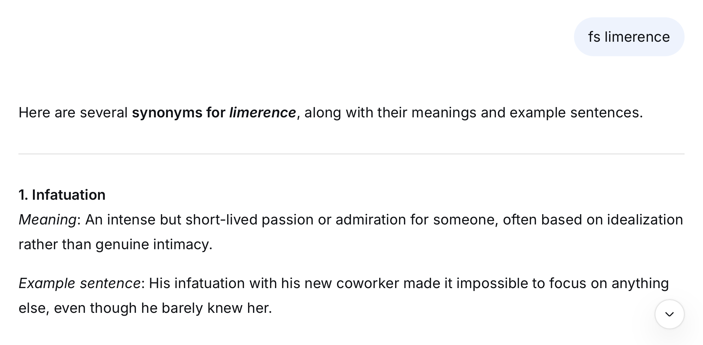

</details>

In everyday work and life, besides using AI to look up words, another common use case is **asking AI to explain the meaning of terms**.

I assigned the related prompts to the <kbd>d</kbd> key:

```markdown
d: What is []？Define in plain English.

dd: Define [] in professional terms.
```

<details open>
  
<summary><b>Conversation Simulation 2</b></summary>

<br>

**Send**: **d** dancing

**AI's Response**: Defined the meaning of dancing **in plain English**.

**Send**: **dd** AGI

**AI's Response**: Defined the meaning of AGI **in professional terms**.

</details>

Now, looking at the <kbd>s</kbd> key next to the <kbd>d</kbd> key, I've set its basic function to generate summary and its advanced function to close reading.

```markdown
s: Generate a summary of the following: [].

ss: Conduct a close reading of the following: [].
```

<details open>
  
<summary><b>Conversation Simulation 3</b></summary>

<br>

**Send**: **s** a tech news article

**AI's Response**: The summary of this tech news article.

**Send**: **ss** a passage that is a bit hard to understand

**AI's Response**: The close reading of this passage.

</details>

<p align="right">
  <a href="#chapter-3-user-guide">
    
  </a>
</p>

---

### 3.2 How to Use in Combination with the Q, Z and P Key

I wrote many AI prompts, covering a range of vertical categories, including office work, writing, teaching, self-improvement, and response refinement.

When I first started devising AI Keyboard, I only planned to assign two prompts to each key. 

> Using the **a** key as an example, I assigned one prompt to "a", and another to "aa".

But as I went deeper, I found there were plenty of other handy ones that still needed to be added.

So I set some new shortcuts by combining other keys with q&a assistant keys (q, z, and p).

For example, consider the <kbd>n</kbd> key in the Daily Life Zone:

Typing a single <kbd>n</kbd> has AI **report on trending news from the past two days**.

Typing <kbd>nn</kbd> has AI **deliver the latest trending news in a specific field or industry**.

And the prompt preset for <kbd>nz</kbd> is "**Search for the latest information and insights about [].**"

For <kbd>nq</kbd> is "**Search for the latest developments on [] and generate an analysis report.**"

**Here's how to use it**:

<details open>
  
<summary><b>Conversation Simulation 4</b></summary>

<br>

**Send**: **nq** embodied intelligence

**AI's Response**: An analysis report on the latest developments in embodied intelligence.

</details>

Check out the <kbd>i</kbd> key in the Health Zone for a similar case:

<kbd>i</kbd>: I or my []. Please analyze the causes from physiological, psychological and other relevant perspectives.

<kbd>ii</kbd>: I []. To avoid any health risks, what preparations should I make beforehand? And what should I watch out for during the process?

<kbd>iq</kbd>: Share some daily habits that are beneficial for physical health and brain agility.

<kbd>iz</kbd>: I have []. Given this, first help me understand the potential consequences and what's at stake. Then remind me to take a break immediately. Finally, provide some simple and effective ways to rest.

<kbd>ip</kbd>: I or my []. Please provide emergency procedures along with relevant precautions.

<p align="right">
  <a href="#chapter-3-user-guide">
    
  </a>
</p>

---

### 3.3 How to Use the Office Zone Keys

<p>
 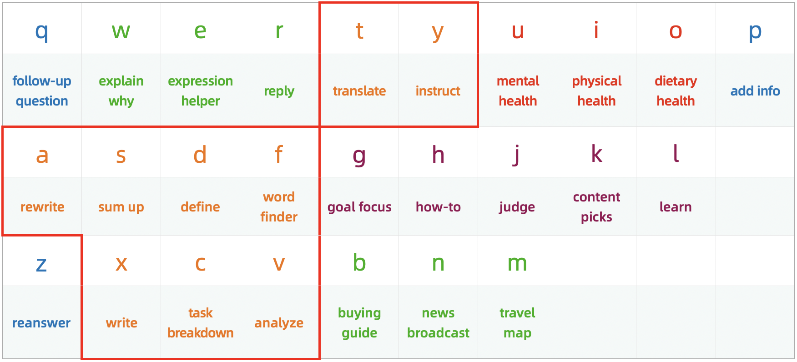
</p>

The basic functions of the keys in the Office Zone are to write(x), translate(t), polish(a), sum up(s), define(d), look up(f), instruct(y), break down(c) and analyze(v).

I'd like to focus on the <kbd>a</kbd>, <kbd>f</kbd>, <kbd>x</kbd> and <kbd>v</kbd> keys, as I wrote many practical prompts for them.

<p align="right">
  <a href="#chapter-3-user-guide">
    
  </a>
</p>

#### 3.3.1 A Key Usage

Typing a single <kbd>a</kbd> polishes the text; while typing <kbd>aa</kbd> checks the text.

And typing <kbd>aq</kbd> can let AI rewrite the text using different rhetorical devices; while typing <kbd>az</kbd> has AI rewrite the text in a simpler and more accessible way.

Furthermore, I configured <kbd>a+</kbd> and <kbd>a-</kbd> as shortcuts, with the following assigned prompts:

```markdown
a+: Rewrite, more comprehensive and detailed: [].

a-: Rewrite, more concise: [].
```

<details open>
  
<summary><b>Conversation Simulation 5</b></summary>

<br>

**Send**: **a+** a viewpoint

**AI's Response**: This viewpoint has been rewritten in a more comprehensive and detailed way.

**Send**: **a-** a lengthy article

**AI's Response**: This article has been rewritten in a more concise way.

</details>

---

#### 3.3.2 F Key Usage

**To maximize the utility of AI's word lookup feature**, my subsequent improvements involved subdividing the feature into: 

looking up collocation, near-synonym, antonym, synonym, hypernym, hyponym and metonym.

The corresponding shortcuts are: fc, fn, fa, fs, fu, fd and fm.

Additionally, I've integrated specialized lookups for verbs, measure words, onomatopoeic words, adjectives and all inflected forms of a word.

The corresponding shortcuts are: fv, fmw, fow, fadj and fp.

**The following are prompts not covered in Chapter 2, you can add them according to your needs**.

```markdown
fn: Look up near-synonyms for [].

fu: Look up hypernyms for [].

fd: Look up hyponyms for [].

fm: Look up metonyms for [].

fv: Look up verbs related to [].

fmw: Look up measure words for [].

fow: Look up onomatopoeic words for [].

fadj: Look up adjectives that describe [].

fp: List all inflections of the following words: [].
```

---

#### 3.3.3 X Key Usage

Typing a single <kbd>x</kbd> writes a piece of copy; while typing <kbd>xx</kbd> generates reference templates along with examples.

Meanwhile, you can type <kbd>xq</kbd> to get writing materials on a certain subject, type <kbd>xz</kbd> to turn AI into a generator, and type <kbd>xp</kbd> to let AI help spark your writing ideas.

In addition, I also wrote instructions for AI to **generate prompts**, and the shortcut is <kbd>xc</kbd>.

```markdown
xc: Please help me write an AI prompt, the objectives and requirements are as follows: [].
```

Use it with <kbd>xv</kbd> allows AI to **generate a response using the prompt from the previous turn**.

```
xv: Use it as the prompt I'm sending you.
```

<details open>
  
<summary><b>Conversation Simulation 6</b></summary>

<br>

**Send**: **xc** the objectives and requirements

**AI's Response**: The prompt written for you.

**Send**: **xv**

**AI's Response**: Response generated using the prompt above.

</details>

---

#### 3.3.4 V Key Usage

Typing a single <kbd>v</kbd> analyzes problems using appropriate methods; while typing <kbd>vv</kbd> analyzes from multiple perspectives.

The function of <kbd>vq</kbd> is to analyze the pros and cons, while <kbd>vz</kbd> is to analyze the underlying logic.

I've also set v1, v2, v3, v4, v5, v6 and v7 as shortcuts and empowering them with prompts for **analyzing problems using specific methods**, as follows:

```markdown
v1: Analyze the following using first principles: [].

v2: Analyze the following using the 80/20 rule: [].

v3: Analyze the following using the syllogistic method: [].

v4: Analyze the following using the four-quadrant principle: [].

v5: Analyze the following using the 5 Whys method: [].

v6: Analyze the following using the Six Thinking Hats method: [].

v7: Analyze the following using the seven-step problem-solving method: [].
```

<details open>
  
<summary><b>Conversation Simulation 7</b></summary>

<br>

**Send**: **v1** how to achieve my life ideals

**AI's Response**: Analyzed this question using first principles.

</details>

---

### 3.4 How to Use the Q&A Assistant Zone Keys

<p>
 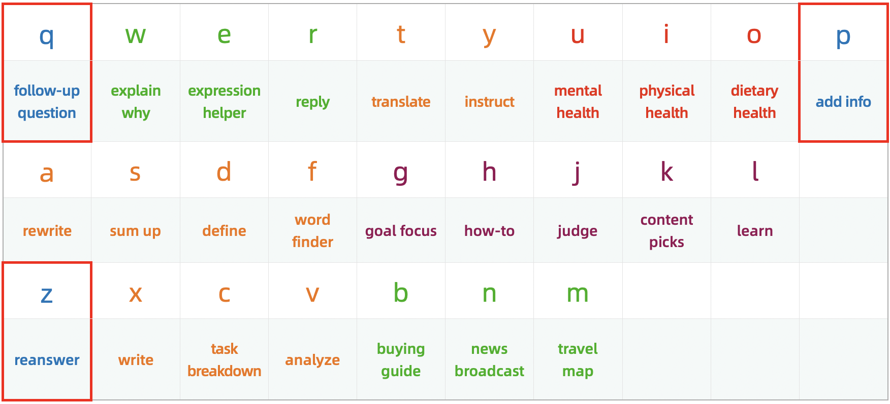
</p>

When interacting with AI, you may want to understand the meaning of a concept mentioned in the response.

And you may also find that the response is too long and want the AI to shorten it.

As another example, you may want to add more context to get the response you're looking for.

That's when the three q&a assistant keys including <kbd>q</kbd>, <kbd>z</kbd>, <kbd>p</kbd> come into play.

<p align="right">
  <a href="#chapter-3-user-guide">
    
  </a>
</p>

#### 3.4.1 Q Key Usage

When you want AI to explain or interpret a specific concept, word, sentence, or paragraph in its response, simply type one <kbd>q</kbd>, then paste what you want to ask further, and hit send.

**Here's how to use it**:

<details open>
  
<summary><b>Conversation Simulation 8</b></summary>

<br>

**Send**: **h** keep myself energetic every day

**AI's Response**: The way to keep energetic every day ("**glycemic index**" was mentioned in the response).

***The prompt preset for h is** "I want to []. What should I do?"*

**Send**: q glycemic index

**AI's Response**: Explained the meaning of glycemic index.

***The prompt preset for q is** "Explain or interpret the following from the above response in detail: []."*

</details>

---

#### 3.4.2 Z Key Usage

Sending a single <kbd>z</kbd> prompts AI to rewrite the generated response to be shorter and easier to understand.

<details open>
  
<summary><b>Conversation Simulation 9</b></summary>

<br>

**Send**: **ll** writing

**AI's Response**: The specific steps, however, are quite lengthy.

***The prompt preset for ll is** "I want to improve my [] skills. What should I do?"*

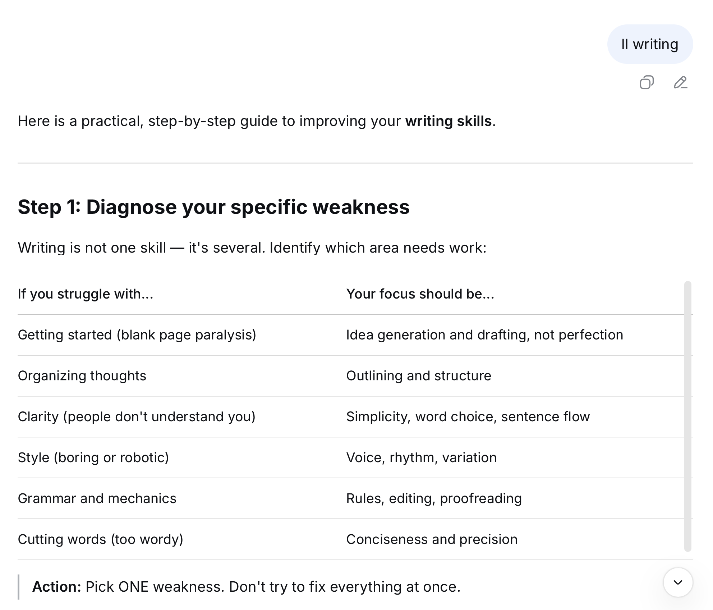

**Send**: z

**AI's Response**: A shorter response with easier-to-understand steps.

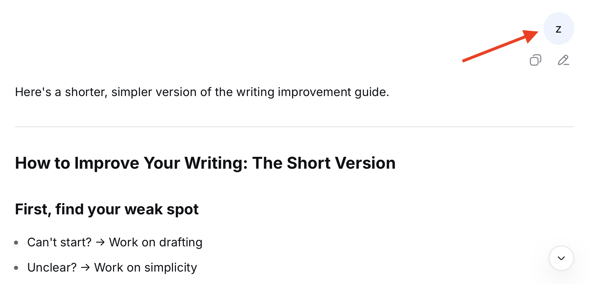

</details>

While sending <kbd>zz</kbd> makes AI generate more related content.

<details open>
  
<summary><b>Conversation Simulation 10</b></summary>

<br>

**Send**: **k** niche sci-fi movies

**AI's Response**: Recommended some movies based on your request, along with the reasons for the recommendations.

***The prompt preset for k is** "Recommend some [], along with the reasons for your recommendations."*

**Send**: zz

**AI's Response**: Recommended some more movies, along with the reasons for the recommendations.

</details>

✨ ✨ ✨ ✨ ✨ ✨

If you feel that the AI's response is not perfect, you can first send <kbd>zc</kbd> to have the AI **analyze the shortcomings in the response and propose improvements**.

```markdown
zc: Analyze the shortcomings in your response and formulate a detailed improvement plan.
```

After receiving the response, send <kbd>zv</kbd> to have the AI **regenerate based on the improvement plan**.

```markdown
zv: Make adjustments or additions based on the improvement plan above.
```

**The specific usage is as follows**: 

<details open>
  
<summary><b>Conversation Simulation 11</b></summary>

<br>

**Send**: **dq** the development of AI

**AI's Response**: A research report on the development of AI.

***The prompt preset for dq is** "Write a research report on []."*

**Send**: zc

**AI's Response**: Analyzed the shortcomings in this research report and formulated a detailed improvement plan.

**Send**: zv

**AI's Response**: Made adjustments or additions based on the improvement plan above.

</details>

---

#### 3.4.3 P Key Usage

Originally, I wrote prompts focused on planning for the <kbd>p</kbd> key.

Later, I realized that filling in information only within the <kbd>[]</kbd> is not enough to fully express the requirements.

Sometimes, the requests being made can also conflict with the prompt assigned to the shortcut.

Take <kbd>tt</kbd> shortcut as an example; its corresponding prompt is: "**Translate the following into Chinese: [].**"

If we enter the text to be translated after <kbd>tt</kbd> and then want to add additional requests, those requests will also be placed within the <kbd>[]</kbd>.

**In the end, AI may translate the requests into Chinese as well, instead of following them as instructions**.

Therefore, I revised the basic function of the <kbd>p</kbd> key to:

```markdown
p: Additional information or requirements are as follows: [].
```

<details open>
  
<summary><b>Conversation Simulation 12</b></summary>

<br>

**Send**: **tt** helping you easily enjoy the convenience brought by Al / **p** give three different versions

**AI's Response**: Translated this sentence into Chinese and provided three different versions.

**The result is shown below:**

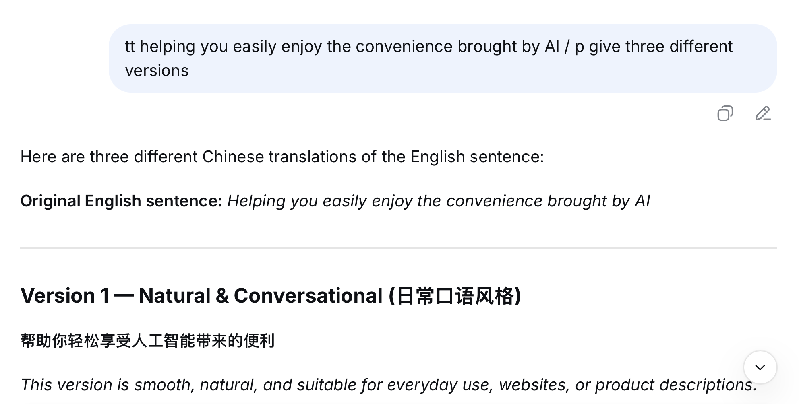

</details>
  
---

### 3.5 How to Use Prompts with Two Pairs of Square Brackets

Some prompts contain two pairs of <kbd>[]</kbd>, for example:

```markdown
yz: How to help [] cultivate or learn []?

gg: In the process of [], I encountered the following problems: []. Please give me some guidance.
```

When using this type of prompt, simply enter a <kbd>/</kbd> as a separator.

<details open>
  
<summary><b>Conversation Simulation 13</b></summary>

<br>

**Send**: **gg** achieving my life goals/feel lost

**AI's Response**: Provided targeted guidance.

</details>

<details open>

<summary><b>Click to hide or show the screenshot of the result</b></summary>

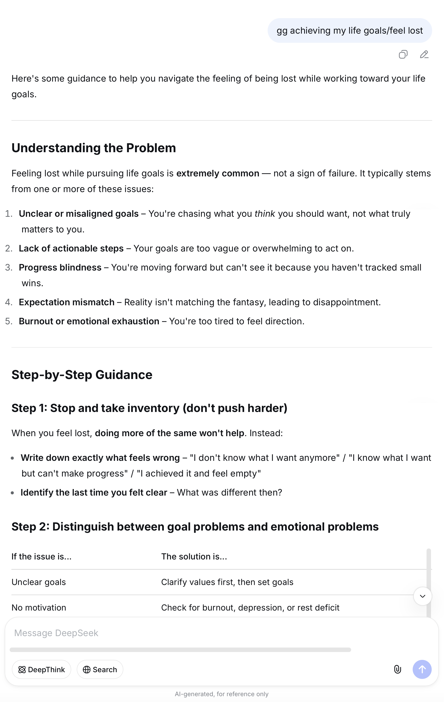

</details>

<p align="right">
  <a href="#chapter-3-user-guide">
    
  </a>
</p>

---

### 3.6 How to Set New AI Keys for AI Keyboard

In AI Keyboard, the shortcut of a prompt is called **AI Key**, such as <kbd>a</kbd>, <kbd>aq</kbd>, <kbd>a1</kbd>, <kbd>v1</kbd>.

And the combination of a shortcut and a prompt is called **aikey**, for example:

```markdown
mq: Generate a travel guide for [].
```

You can directly modify the preset prompts I've assigned to the AI Keys, or you can create your own custom AI Keys, like <kbd>go</kbd>, <kbd>lol</kbd>, <kbd>yyds</kbd>.

I recommend using **a format consisting of one letter and one number** when assigning new AI Keys for AI Keyboard.

I've already configured a few defaults—for example, <kbd>s1</kbd> is for analyzing text, <kbd>x1</kbd> is for writing articles and <kbd>x2</kbd> is for generating titles.

Now, let's also set <kbd>x3</kbd> as an AI Key.

It's simple and takes just two steps:

**Step 1**: Add a colon after "x3" to make it "x3:".

**Step 2**: Write the specific prompt, for instance, asking AI to generate New Year greetings for different Chinese zodiac years.

```markdown
x3: Give me some New Year greetings for the Year of the [].
```

> **Tips**: Consider placing the new aikey after the corresponding key to make it easier to locate and modify later.

<details open>
  
<summary><b>Conversation Simulation 14</b></summary>

<br>

**Send**: **x3** horse

**AI's Response**: Some New Year's greetings for the Year of the Horse.

</details>

✨ ✨ ✨ ✨ ✨ ✨

Also, if your physical keyboard has a numeric keypad, setting the numbers directly as AI Keys will be much more convenient.

For example, assign the number <kbd>1</kbd> as an AI Key to search for and interpret AI news.

```markdown
1: Search for and interpret recent trending news in the field of AI.
```

<details open>
  
<summary><b>Conversation Simulation 15</b></summary>

<br>

**Send**: 1

**AI's Response**: Recent trending news and analysis in the field of AI.

</details>

<p align="right">
  <a href="#chapter-3-user-guide">
    
  </a>
</p>

---

### 3.7 How to Add AI Keyboard to AI Tools

To keep this guide from getting too long, I will only cover how to add AI Keyboard to DeepSeek and Gemini here.

#### 3.7.1 How to Add AI Keyboard to DeepSeek

**Method 1**

Copy the prompts from Chapter 2 into the input box, and then send them to DeepSeek.

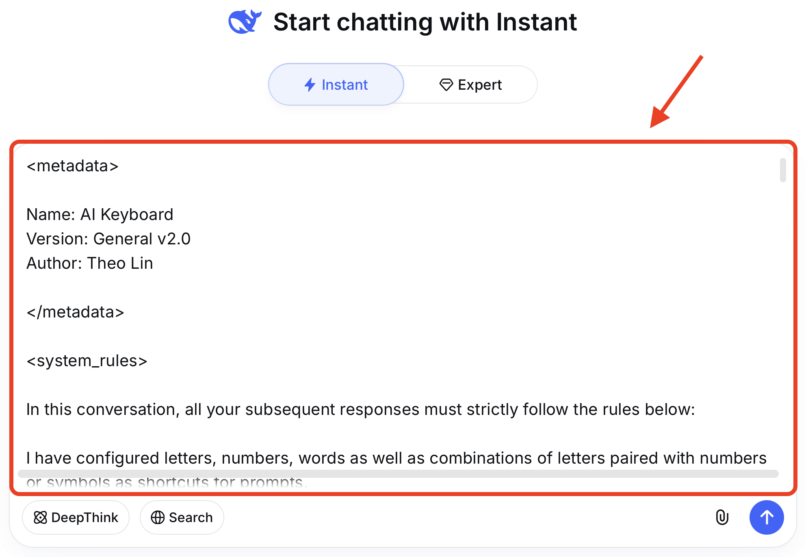

**Method 2**

Copy the prompts from Chapter 2 into a document, and then upload the document.

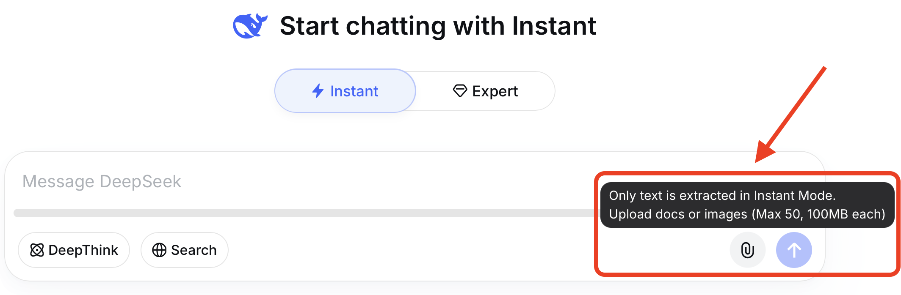

> **Tips**: Consider pinning the conversation containing these prompts for quick access and reuse.

---

#### 3.7.2 How to Add AI Keyboard to Gemini

**First**, click "Gems" in Settings:

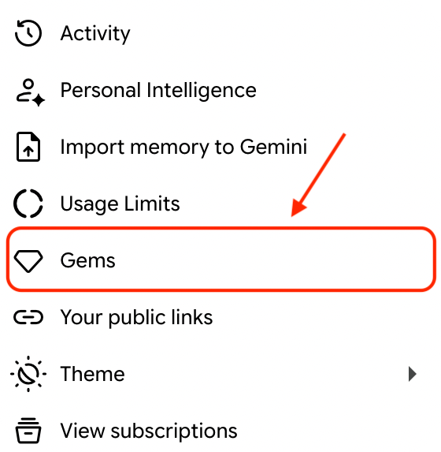

**Then** create a new Gem:


**Finally** copy the prompts from Chapter 2 into the "Instructions" field and save it:

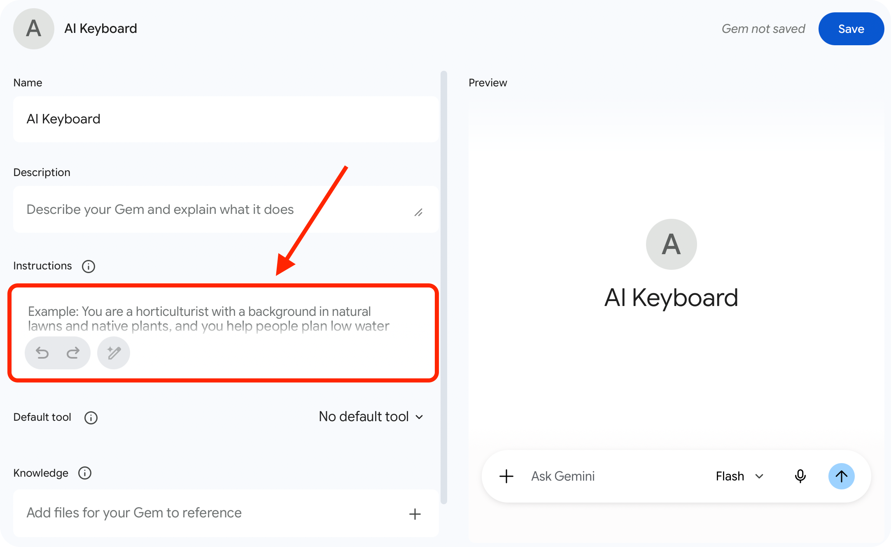

<p align="right">
  <a href="#chapter-3-user-guide">
    
  </a>
</p>

---

## Chapter 4 How to Remember Each Key's Prompts

When I was devising AI Keyboard, I intentionally created associations between `letter`, `prompt` and `words or Pinyin associated with the letter`.

So that they can be memorized using **mnemonic techniques**.

For example, the basic function of the <kbd>q</kbd> key is to **ask follow-up questions**, so you can associate it with the word "**question**", which help you remember that the <kbd>q</kbd> key includes prompts related to asking questions.

Similarly, the basic function of the <kbd>b</kbd> key is "**I want to buy []. How should I choose?**" which is related to shopping.

So you can use the word "**buy**" to help remember the prompts included in the <kbd>b</kbd> key.

Besides words, you can also use **pinyin initials** or **letter shapes** as memory aids to remember the prompts assigned to each key.

**The specific memorization methods are as follows**:

<details open>
  
<summary><b>The letters in the top row</b></summary>

<br>

The <kbd>q</kbd> key's function is to ask follow-up questions, its mnemonic is "**question**".

The <kbd>w</kbd> key's function is to explain why, its mnemonic is "**why**".

The <kbd>e</kbd> key's function is to help with expression, its mnemonic is "**express**".

The <kbd>r</kbd> key's function is to reply message, its mnemonic is "**reply**".

The <kbd>t</kbd> key's function is to translate text, its mnemonic is "**translate**".

The <kbd>y</kbd> key's function is to provide instructions, its mnemonic is "**Yoda**".

The <kbd>u</kbd> key's function is related to mental health, its mnemonic is "**unconscious**".

The <kbd>i</kbd> key's function is related to physical health, its mnemonic is "**in good health**".

The <kbd>o</kbd> key's function is related to dietary health, its mnemonic is "**oral**" and the letter "o" can be seen as an open mouth.

The <kbd>p</kbd> key's function is to add information, its mnemonic is "**plus**" or "**postscript**".

</details>

<details open>
  
<summary><b>The letters in the middle row</b></summary>

<br>

The <kbd>a</kbd> key's function is to rewrite text, its mnemonic is "**adapt**".

The <kbd>s</kbd> key's function is to generate summary, its mnemonic is "**sum up**".

The <kbd>d</kbd> key's function is to define terms, its mnemonic is "**define**".

The <kbd>f</kbd> key's function is to look up words, its mnemonic is "**find**".

The <kbd>g</kbd> key's function is to help focus on the goal, its mnemonic is "**goal**".

The <kbd>h</kbd> key's function is to generate guide, its mnemonic is "**how**".

The <kbd>j</kbd> key's function is to provide an evaluation, its mnemonic is "**judge**".

The <kbd>k</kbd> key's function is to offer content picks, its mnemonic is "**pick**".

The <kbd>l</kbd> key's function is to generate study guidance, its mnemonic is "**learn**".

</details>

<details open>
  
<summary><b>The letters in the bottom row</b></summary>

<br>

The <kbd>z</kbd> key's function is to revise the response, its mnemonic is "**zapper**".

The <kbd>x</kbd> key's function is to generate text, its mnemonic is "**xie**", which is the pinyin of the Chinese character "写" (write). You can also think of "x" as two pens crossing each other.

The <kbd>c</kbd> key's function is to break down tasks, its mnemonic is "**chunking**".

The <kbd>v</kbd> key's function is to analyze problems, its mnemonic is "**view**".

The <kbd>b</kbd> key's function is to serve as a buying guide, its mnemonic is "**buy**".

The <kbd>n</kbd> key's function is to serve as a news broadcast, its mnemonic is "**news**".

The <kbd>m</kbd> key's function is to serve as a travel map, its mnemonic is "**map**".

</details>

<p align="right">
  <a href="#toc">
    
  </a>
</p>

---

## Chapter 5 Motivation and Inspiration

### 5.1 Why I Created AI Keyboard

I often use AI as a dictionary to look up words and get definitions for terms or concepts.

I also turn to AI for dietary advice—like asking if a certain food is still safe to eat, or whether it's better to have something before or after a meal. 

Asking AI directly when you have questions is not only highly efficient, but also allows you to ask follow-up questions within the same conversation. 

However, having to retype or copy and paste prompts before every query is both tedious and time-consuming.

**So I started thinking about how to make prompts more convenient to use**.

---

### 5.2 Sources of Inspiration

My inspiration comes from the game League of Legends.

One day, while pressing the <kbd>q</kbd>, <kbd>w</kbd>, <kbd>e</kbd>, <kbd>r</kbd> keys on the keyboard to cast a champion's abilities, a thought suddenly occurred to me:

**Why not just assign prompts to the 26 letters on a keyboard?**

**The prompt content** is basically the description of a champion's ability.

**Entering a specific letter into the input box** indicates the intention to cast the corresponding ability.

**Adding information in []** is similar to adjusting the ability's directional indicator by moving the mouse.

**Pressing the send button or the Enter key** is equivalent to a mouse click to cast the ability.

After that, I started writing prompts for the 26 letters on a keyboard.

<p align="right">
  <a href="#toc">
    
  </a>
</p>

</details>

---

## 📄 License

This project is open source and freely available under the **Apache License 2.0**.

✅ Under this license, you may:

- **Modify** AI Keyboard  according to your needs.
- **Integrate** AI Keyboard into your own tools or applications.
- **Use** AI Keyboard in both personal and **commercial projects**.

## 🤝 Contributing

I'm well aware that my personal perspective and tech stack are limited, and I truly look forward to creative developers from the community getting involved.

Let's work together to add more inspiration and features to **AI Keyboard** and build it into a powerful tool.

You can contribute in the following ways:

1. ⭐️ **Give it a Star**: Help boost the visibility of this project so more people in need can find it.
2. 📣 **Spread the word**: If you find AI Keyboard useful, feel free to share  it with your friends or colleagues.
3. 💻 **Share feedback**: You're welcome to open an Issue or submit a PR if you have ideas, find bugs, or would like to suggest new features.

---

## 💬 Author's Note

**I'm willing to take a leap of faith for my ideals**.

To fully realize my vision for AI Keyboard, I chose to work on it full-time and am currently living off my savings.

**I've spent a great deal of time and energy crafting, improving, and refining AI Keyboard, with many late nights writing this user guide**.

Because I want to pack the general version with **as many prompts and use cases as possible** for you.

And because I want to help you get up to speed quickly and experience what it feels like to **have prompts at your fingertips**.

## ☕️ Support & Appreciation

Although building things for passion is great, to be honest, sustaining this full-time independent work does come with significant financial pressure.

If you'd like to support my work, you're warmly welcome to buy me a coffee or a meal.

Every bit of your support helps extend the runway for my solo development journey, giving me more confidence and freedom to keep creating.

<table border="0">
  <tr>
    <td align="center">
      <br>
      
    </td>
    <td align="center">
     <br>
     <a href="https://ko-fi.com/theolin" target="_blank">
        
      </a>
    </td>
  </tr>
</table>

## 🌟 Supporters List

Please leave your **GitHub ID or nickname** in the note.

Regardless of the amount, I'll add you to the supporters list below to thank you for your support.

| 🌟 Supporter | 📅 Date |
| :---: | :---: |
| **TBD** | *coming soon* |
| **TBD** | *coming soon* |
| **TBD** | *coming soon* |

## ✍️ Final Thoughts

Finally, I'd like to close with the tagline I came up with for my blog:

Just AI it, 大胆去AI吧.

---

<div align="center">

**Made with ❤️ by Theo Lin**
  
*May the spirit of open source be with you. Happy coding! <a href="#top" style="text-decoration: none;" title="Back to top">🚀</a>*

</div>