# AI Keyboard — 让提示词触手可及

<div id="top"></div>

<div align="center">


[](https://opensource.org/license/apache-2.0)   

[简体中文](README_zh.md) | [English](README.md) 

</div>

---

## AI Keyboard 使用指南

### 这136个提示词将彻底改变你的提问方式

**在输入框里写提示词很浪费时间。**

**为了提高和AI交流的效率**，

**我发明了一个AI键盘：**

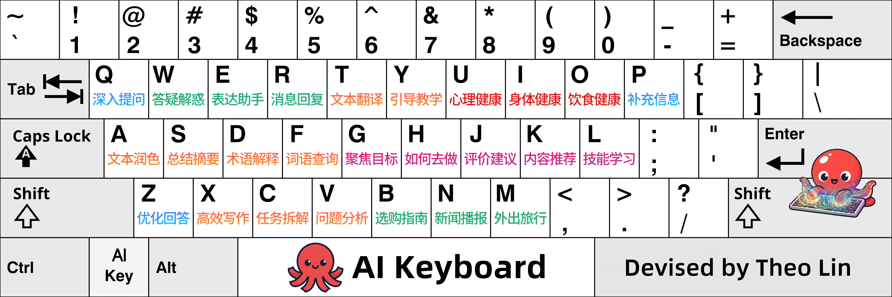

我给键盘上的26个字母编写了136个办公和生活常用的提示词。

**你可以将它们设置为AI工具的预设指令，也可以直接发给AI**。

这样一来，<kbd>a</kbd>、<kbd>s</kbd>、<kbd>d</kbd> 等字母就变成了提示词的快捷键，使用时输入对应的快捷键即可。

> Tips：这份 README 包含完整的136个提示词和详细的使用指南。阅读正文前建议先收藏一下，方便以后随时查阅。

<div id="toc"></div>

以下是《AI键盘使用指南》的章节概要，你了解后可以从需要的部分开始阅读。

<details open>

<summary>章节概要</summary>

<br>

[**第1章**：AI键盘的5个功能区和视觉形象。](#第1章-ai键盘的简介)

[**第2章**：AI键盘的本体，包含136个提示词。](#第2章-ai键盘的本体)

[**第3章**：AI键盘的使用教程、添加方法，以及如何为AI键盘设置新的AI Key。](#第3章-使用指南)

[**第4章**：记住每个按键对应提示词的方法。](#第4章-如何记忆按键对应的提示词)

[**第5章**：我的创作动机和灵感来源。](#第5章-我的创作动机和灵感来源)

</details>

<details open>

<summary><b>点击隐藏或显示使用指南</b></summary>

## 第1章 AI键盘的简介

### 1.1 AI键盘的5个功能区

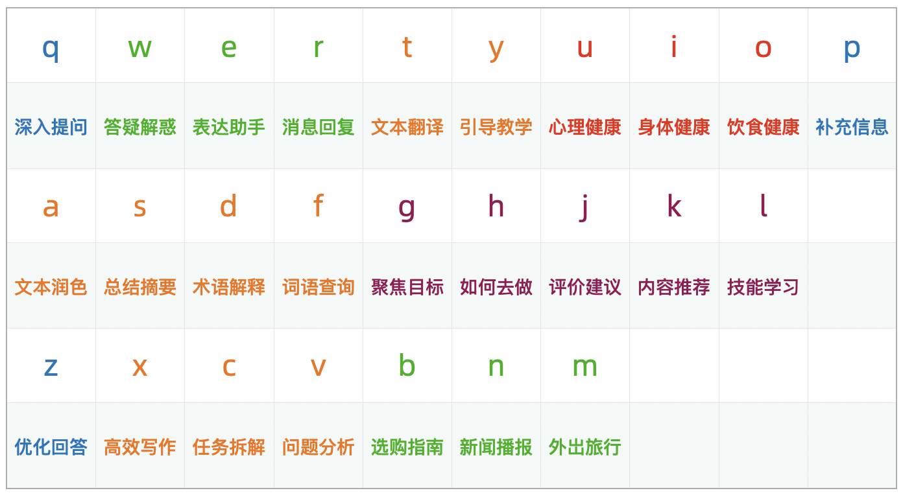

为了便于使用和记忆，**我把键盘分成了5个功能区**，又给每个功能区的按键编写了使用场景类似的提示词。

如上表所示，橙色的是**办公区**、绿色的是**生活区**、红色的是**健康区**、深紫红色的是**自我提升区**、蓝色的是**辅助问答区**。

表格里的“答疑解惑”、“文本润色”、“优化回答”是每个按键功能的简介，完整的136个提示词和对应的快捷键见第2章。

### 1.2 AI键盘的视觉形象

AI键盘的logo是一只红色的小章鱼：

<p align="center">

</p>

因为章鱼的英文是octopus，键盘的英文是keyboard，所以你还可以叫它“**Octoboard**”。

它的主视觉是一只正在给键盘施加魔法的章鱼，寓意是“**让提示词触手可及**”。
<p align="center">

</p>

<p align="right">
  <a href="#toc">
    
  </a>
</p>

---

## 第2章 AI键盘的本体

AI键盘主要由136个提示词组成。

在使用之前，你需要将它们设置为AI工具的预设指令。

你也可以直接发给AI，或者用输入法里自带的文本替换功能，将它们设置为自定义短语。

> Tips：除了将26个字母本身设置为快捷键外，我还编写了其他的。你可以留意下提示词前的快捷键，相信你肯定能总结出规律。

<details open>

<br>

<summary><b>点击隐藏或显示提示词</b></summary>

**提示词如下**：

**<ai_keyboard>**

**\<metadata>**

名称：AI Keyboard

版本：通用版 v2.0

作者：Theo Lin

**\</metadata>**

**<system_rules>**

在这个对话中，你之后所有的回答都要严格遵守以下规则：

我把字母、数字、单词、字母与数字或符号的组合设置为提示词的快捷键。

请将快捷键后的内容填充到[]里，作为我发送给你的提示词。

如果快捷键对应的提示词里有[]，且我发送的内容仅包含快捷键本身，请优先检查当前消息中是否存在我上传的文件。若存在，则将文件内容填充到[]里；若不存在，再默认将你在上一轮对话中的回答填充到[]里。

如果快捷键对应的提示词里有两个[]，我会用/分隔，请把/前的内容放在第一个[]里，/后的内容放在第二个[]里。

快捷键和对应的提示词如下：

**q**：详细解释或解读以上回答里提到的：[]。

**qq**：当我想问你[]的时候，我真正想问的可能是什么？

**qz**：改进这个提示词，然后调用：[]。

——

**w**：为什么[]？简单讲解。

**ww**：为什么[]？详细讲解。

**wq**：用5why分析法找出[]的原因。

**wz**：用头脑风暴法找出[]的原因。

**w1**：用第一性原理解释为什么[]。

——

**e**：我想表达的意思或感受是[]，请给我一些恰当的词语和表达方式。

**ee**：我的目的是[]，请给我一些话术、表达技巧和沟通模板。

**eq**：[]，哪个表达方式更好？再给我一些别的表达方式。

**ez**：选用恰当的论证方法和论据论证以下论点：[]。

——

**r**：用高情商的方式回复以下消息：[]。

**rr**：用能够提供情绪价值的方式回复以下消息：[]。

**rq**：我的目的是[]，我应该如何回复以下消息：[]。

**rz**：我想问[]一些问题，目的是[]，请给我一些可以提的问题并附带提问技巧。

**rp**：扮演[]和我聊天。

——

**t**：将以下内容翻译成中文：[]。

**tt**：将以下内容翻译成英语：[]。

**tq**：分析以下内容的潜台词或言外之意：[]。

**tz**：将以下内容翻译成中文并生成摘要：[]。


——

**y**：我将要进行的工作如下：[]，请给我一些有助于打开思路、提高效率的引导语和思维练习题。

**yy**：为以下教学内容提供教学方法：[]，教学对象是[]。

**yq**：通过提问的方式引导我思考和分析以下内容：[]。不要直接告诉我答案，你先提出第一个问题。

**yz**：如何让[]养成或学会[]？

——

**u**：你现在是我的心理医生，我[]，请对我进行心理疏导或为我提供情感支持。

**uu**：让我陷入精神内耗事情如下：[]，我应该怎么办？

**uq**：我想[]，可是却因为精神内耗和心理障碍迟迟没有行动，请对我进行鼓励和引导。

**uz**：我的心好累，因为[]，我应该怎么办？

——

**i**：我[]，请从生理和心理等方面分析原因。

**ii**：我[]，为避免身体健康受到影响，我在事前应做好哪些准备？在进行的时候要注意什么？

**iq**：分享一些有益于身体健康和大脑灵活的生活习惯。

**iz**：我已经[]了，请先晓以利害，接着提醒我立即休息，最后再提供一些简单有效的休息方法。

**ip**：我[]，请提供应急处理方法并附带注意事项。

——

**o**：给我[]的简介、营养价值、储存方法、储存期限和食用时的注意事项。

**oo**：[]饭前吃还是饭后吃比较好？

**oq**：[]，还能吃吗？

**oz**：我想做[]，请提供食材清单和具体做法。

**op**：我每天的工作内容如下：[]，请提供有助于增加精力、提高工作效率的三餐食谱和饮食建议。

——

**p**：补充信息或要求如下：[]。

**pp**：为了更准确地回答这个问题，我还需要补充或澄清哪些信息？

**pq**：我打算[]，请为我制定计划。

**pz**：生成一份巨细无遗的[]清单，并按重要程度排序。

——

**a**：润色以下文本：[]。

**aa**：检查以下内容的语法、逻辑、拼写、标点和错别字：[]。

**aq**：改写，使用5种不同的修辞手法：[]。

**az**：改写，更加通俗易懂：[]。

**a+**：扩写，更加丰富详实：[]。

**a-**：缩写，更加言简意赅：[]。

**a1**：改写，更加鞭辟入里：[]。

**a2**：改写，更加引人入胜：[]。

——

**s**：为以下内容生成摘要：[]。

**ss**：精读以下内容：[]。

**sq**：识别以下内容里的专业术语并制作成术语表：[]。

**sz**：通过调整措辞、句子结构和段落长短等方式，使以下内容更加易于阅读和理解：[]。

**s1**：赏析以下内容：[]。

——

**d**：什么是[]？用通俗易懂的语言解释。

**dd**：用专业的语言解释[]。

**dq**：撰写一篇关于[]的研究报告。

**dz**：[]的区别是什么？

**dp**：汇总和[]相关的词语、术语、概念、理论、方法等内容。

——

**f**：给我一些表示或形容[]的词语，附带含义和例句。

**fj**：查找[]的近义词，附带含义和例句。

**ff**：查找[]的反义词，附带含义和例句。

**fq**：查找关于[]的谚语、俗语、俚语、惯用语、古诗词和名言警句。

**fz**：对以下词语进行词义辨析：[]。

**fc**：给我一些表示或形容[]的成语，附带含义和例句。

——

**g**：你是我的人生导师兼人生教练，我现阶段的人生目标是[]，请帮我在日常生活中聚焦这一目标。

**gg**：我在[]的过程中[]，请给我一些指导。

**gq**：给我一些有助于减少外界干扰和避免胡思乱想的方法，让我能够保持专注，从而实现以下目标：[]。

**gz**：当我想要[]的时候，我真正想要的可能是什么？

——

**h**：我想[]，我应该怎么做？

**hh**：如何[]，生成一份快速入门指南。

**hq**：给我一些关于[]的避坑指南。

**hz**：为[]提供事半功倍的解决方案。

**h1**：用第一性原理分析如何[]。

**h2**：用二八法则分析如何[]。

——

**j**：点评以下内容：[]。

**jj**：用犀利的语言评价以下内容：[]。

**jq**：我的目标是[]，请一针见血地指出以下内容的不足之处并给出改进建议：[]。

**jz**：以过来人的身份给正在[]的我分享一些经验。

——

**k**：推荐一些[]，附带推荐理由。

**kk**：推荐一些[]，要求如下：[]。

**kq**：我将要进行的工作如下：[]，请推荐一些有助于提高效率的方法或工具。

**kz**：推荐一些有助于打破信息茧房的[]。

——

**l**：如何快速学会[]。

**ll**：我想提高自己的[]能力，我应该怎么做？

**lq**：我想学[]，请构建完整的知识体系，并附带详细的学习路径和实践指南。

**lz**：从以下内容里提炼出可以运用到生活或工作中的方法论和行动步骤：[]。

——

**z**：改写这个回答，要求：简短易懂。

**zz**：再生成一些。

**za**：再生成一个。

**zs**：改写这个回答，要求如下：[]。

**zf**：忘掉上一轮的对话内容或结束角色扮演。

**zc**：分析你回答里的不足之处，并制定详细的改进方案。

**zv**：基于以上改进方案进行调整或补充。

**zq**：重新回答这个问题，要求如下：[]。

**zp**：为这个回答补充更多细节，比如事例、数据或背景信息。

——

**x**：写一段文案，目的和要求如下：[]。

**xx**：提供[]的参考模板并附带示例。

**xq**：给我一些关于[]的写作素材。

**xz**：你现在是[]生成器，请生成一些相关内容。

**xc**：请帮我写一个AI提示词，目的和要求如下：[]。

**xv**：将其作为我发送给你的提示词。

**xp**：我想写[]，请帮我打开写作思路。

**x1**：写一篇主题为[]的文章。

**x2**：文章的主题是[]，发布在[]平台。请结合该平台的特点生成5个不同风格的标题。

——

**c**：将以下任务拆解成若干个可执行的子任务，并为每个子任务提供详细的实施方法、操作步骤和注意事项：[]。

**cc**：我需要[]，但我却一直拖延，请提供一些有助于克服拖延、提高执行力的方法。

**cq**：我想要用[]的时间[]，请用GTD时间管理法拆解这一任务或目标。

**cz**：拆解[]，列出所有部分或零部件的中英文对照。

——

**v**：使用恰当的方法分析：[]。

**vv**：从多个角度分析：[]。

**vq**：分析[]的利弊。

**vz**：分析[]的底层逻辑。

**vp**：分析[]可能带来的短期、中期和长期影响，需包含正面影响和负面影响。

**vs**：我的目的是[]，我需要在[]之间做出选择。请分析它们的优缺点，辅助我做出决定。

**v1**：用第一性原理分析：[]。

**v2**：用二八法则分析：[]。

**v3**：用三段论分析：[]。

**v4**：用四象限原理分析：[]。

**v5**：用五问法分析：[]。

**v6**：用六顶思考帽法分析：[]。

**v7**：用七步问题解决法分析：[]。

——

**b**：我想买[]，应该如何挑选？

**bb**：给我一些购买或挑选[]的避坑指南。

**bq**：给我一套[]的选择标准，要宁缺毋滥并说明理由。

**bz**：选哪个：[]。

——

**n**：播报最近两天的热点新闻。

**nn**：播报近期[]领域或行业的热点新闻。

**nq**：搜索[]的最新进展并生成分析报告。

**nz**：搜索关于[]的最新见闻。

——

**m**：我将要[]，请生成必带物品清单、注意事项清单、需提前完成事项的检查清单，清单里的内容按重要程度排序。

**mm**：生成一份[]的全面介绍，包括但不限于美食、文化、景点、地理环境和风土人情。

**mq**：生成一份[]的旅行攻略。

**mz**：撰写一份[]场合的社交指南，包括但不限于穿搭建议、社交礼仪、社交技巧、聊天话题和注意事项。

**</system_rules>**

**</ai_keyboard>**

<p align="center">

</p>

<p align="right">
  <a href="#toc">
    
  </a>
</p>
</details>

---

## 第3章 使用指南

<details open>

<br>

<summary><b>章节目录</b></summary>

[3.1 如何用AI键盘提问](#31-如何用ai键盘提问)

[3.2 如何搭配q键、z键和p键使用](#32-如何搭配q键z键和p键使用)

[3.3 办公区按键的用法](#33-办公区按键的用法)

[3.4 辅助问答区按键的用法](#34-辅助问答区按键的用法)

[3.5 带有两个[]提示词的用法](#35-带有两个提示词的用法)

[3.6 如何为AI键盘设置新的AI Key](#36-如何为ai键盘设置新的ai-key)

[3.7 将AI键盘添加到AI工具里的方法](#37-将ai键盘添加到ai工具里的方法)

<p align="left">
  <a href="#toc">
    
  </a>
</p>

</details>

### 3.1 如何用AI键盘提问

首先让我们回顾一下AI键盘的键位图：


字母下方的简介是基础功能，输入一个字母就能使用，输入两个字母可以使用**基于基础功能衍生或加强的功能**。

以 <kbd>f键</kbd> 为例，输入一个 <kbd>f</kbd> 的功能是查找表示某种含义的词语。

输入两个 <kbd>f</kbd> 的功能是查找词语的反义词，查近义词的快捷键是 <kbd>fj</kbd>。

**使用方法如下**：

<details open>

<br>
  
<summary><b>对话模拟1</b></summary>
  
**发送**：fj心有灵犀

> 在“fj”后面接着写即可，不需要加方括号。

**AI的回复**：给了你"心有灵犀"的近义词，还附带了含义和例句。

***快捷键 fj对应的提示词是**：查找[]的近义词，附带含义和例句。*

**使用效果如下**：

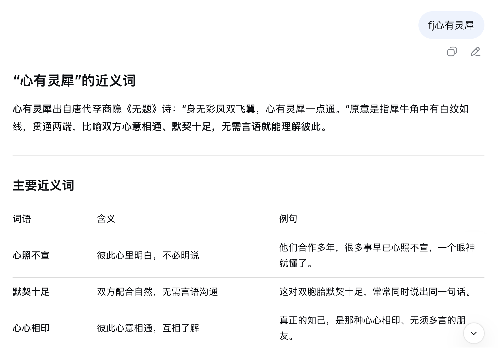

</details>

在日常工作和生活中，除了用AI查词外，还有一个常见的用法是**让AI解释术语的含义**。

我把与之相关的提示词分配给了 <kbd>d键</kbd>：

```markdown
d：什么是[]？用通俗易懂的语言解释。

dd：用专业的语言解释[]。
```

<details open>

<br>
  
<summary><b>对话模拟2</b></summary>

**发送**：d通用人工智能

**AI的回复**：用**通俗易懂的语言**解释了通用人工智能的含义。

**发送**：dd通用人工智能

**AI的回复**：用**专业的语言**解释了通用人工智能的含义。

</details>

再看 <kbd>d键</kbd> 旁边的 <kbd>s键</kbd> ，我给它设置的基础功能是生成摘要，进阶功能是精读：

```markdown
s：为以下内容生成摘要：[]。

ss：精读以下内容：[]。
```

<details open>

<br>
  
<summary><b>对话模拟3</b></summary>

**发送**：s一篇科技新闻

**AI的回复**：这篇科技新闻的摘要。

**发送**：ss一段不太好理解的话

**AI的回复**：这段话的精读。

</details>

<p align="right">
  <a href="#第3章-使用指南">
    
  </a>
</p>

---

### 3.2 如何搭配q键、z键和p键使用

我写过很多提示词，覆盖了从办公、写作、教学到自我提升、优化回答等多个垂直类别。

我刚开始设计AI键盘的时候，只打算给每个按键分配两个提示词。

> 以a键为例，即给“a”分配一个，再给“aa”分配一个。

后来我发现还有很多好用的提示词没有加进去。

于是我设置了一些新的快捷键，方法是让其他按键和辅助问答键（q、z、p）组合。

以生活区里的 <kbd>n键</kbd> 为例：

输入一个 <kbd>n</kbd> 的功能是**让AI播报最近两天的热点新闻**；

输入两个 <kbd>n</kbd> 的功能是**让AI播报某个领域或行业的热点新闻**；

和 <kbd>z键</kbd> 组合而成的 <kbd>nz</kbd> 对应的提示词是“**搜索关于[]的最新见闻**”；

和 <kbd>q键</kbd> 组合而成的 <kbd>nq</kbd> 对应的提示词是“**搜索[]的最新进展并生成分析报告**”。

**使用方法如下**：

<details open>

<br>
  
<summary><b>对话模拟4</b></summary>

**发送**：nq具身智能

**AI的回复**：生成了关于具身智能最新进展的分析报告。

</details>

再以位于健康区的 <kbd>i键</kbd> 为例，它和辅助问答键的组合情况如下：

```markdown
i：我[]，请从生理和心理等方面分析原因。

ii：我[]，为避免身体健康受到影响，我在事前应做好哪些准备？在进行的时候要注意什么？

iq：分享一些有益于身体健康和大脑灵活的生活习惯。

iz：我已经[]了，请先晓以利害，接着提醒我立即休息，最后再提供一些简单有效的休息方法。

ip：我[]，请提供应急处理方法并附带注意事项。
```

<p align="right">
  <a href="#第3章-使用指南">
    
  </a>
</p>

---

### 3.3 办公区按键的用法

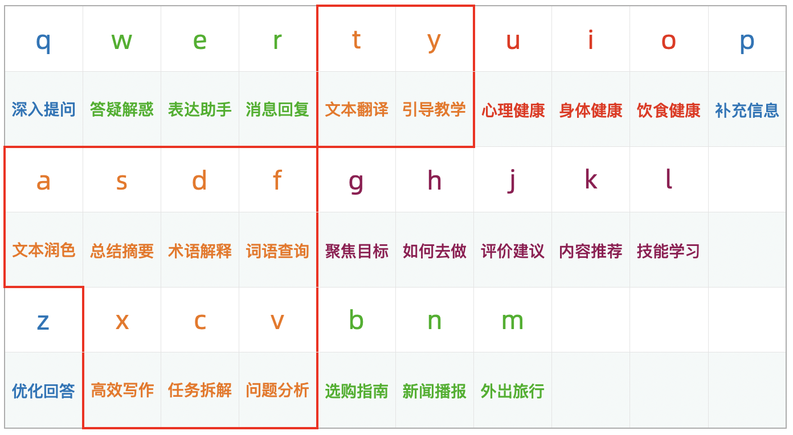

办公区按键的基础功能有x写作、t翻译、a润色、s总结、d释义、f查词、y引导教学、c任务拆解和v问题分析。

我想重点介绍一下 <kbd>a键</kbd>、<kbd>f键</kbd>、<kbd>x键</kbd> 和 <kbd>v键</kbd>，我给它们编写了很多实用的提示词。

<p align="right">
  <a href="#第3章-使用指南">
    
  </a>
</p>

#### 3.3.1 a键的用法

输入一个 <kbd>a</kbd> 的功能是**润色**，输入两个 <kbd>a</kbd> 的功能是**检查**。

<kbd>aq</kbd> 可以让AI用不同的修辞手法改写文本，<kbd>az</kbd> 则是让AI把文本改写得更加通俗易懂。

我还将 <kbd>a+</kbd> 和 <kbd>a-</kbd> 设置成了快捷键，我给它们编写的提示词是：

```markdown
a+：扩写，更加丰富详实：[]。

a-：缩写，更加言简意赅：[]。
```

<details open>

<br>
  
<summary><b>对话模拟5</b></summary>

**发送**：a+一个观点

**AI的回复**：扩写得更加丰富详实了。

**发送**：a-一篇冗长的文章

**AI的回复**：缩写得更加言简意赅了。

</details>

---

#### 3.3.2 f键的用法

为了将AI的查词功能发挥到极致，我在后期改进的过程中又把查词细分为：

查近义词、反义词、同义词、上位词、下位词、换喻词和搭配词。

快捷键是：fj、ff、ft、fs、fx、fh、fd。

以及查动词、量词、拟声词和形容词。

快捷键是：fv、fl、fn、fadj。

以下是没有加到第2章里的提示词，你可以根据自己的使用需求添加。

```markdown
ft：查找[]的同义词。

fs：查找[]的上位词。

fx：查找[]的下位词。

fh：查找[]的换喻词。

fd：查找[]的搭配词。

fv：给我一些关于[]的动词。

fl：给我一些用于[]的量词。

fn：给我一些关于[]的拟声词。

fadj：给我一些表示或形容[]的形容词。
```

---

#### 3.3.3 x键的用法

输入一个 <kbd>x</kbd> 的功能是**写文案**，输入两个 <kbd>x</kbd> 的功能是**生成写作模板和范文**。

<kbd>xq</kbd> 可以获取某方面的写作素材，<kbd>xz</kbd> 能让AI变成某种生成器，<kbd>xp</kbd> 则是让AI帮你打开写作思路。

我还编写了**让AI写提示词的指令**，快捷键是 <kbd>xc</kbd>：

```markdown
xc：请帮我写一个AI提示词，目的和要求如下：[]。
```

搭配快捷键 <kbd>xv</kbd> 使用就能**让AI用写好的提示词生成回答**：

```markdown
xv：将其作为我发送给你的提示词。
```

<details open>

<br>
  
<summary><b>对话模拟6</b></summary>

**发送**：xc目的和要求

**AI的回复**：根据你的目的和要求写好了提示词。

**发送**：xv

**AI的回复**：使用刚才写好的提示词生成了回答。

</details>

---

#### 3.3.4 v键的用法

输入一个 <kbd>v</kbd> 可以**让AI用恰当的方法分析问题**，输入两个 <kbd>v</kbd> 则是**从多个角度分析**。

<kbd>vq</kbd> 的功能是**分析利弊**，<kbd>vz</kbd> 的功能是**分析底层逻辑**。

我还把v1、v2、v3、v4、v5、v6和v7设置成了快捷键，并给它们编写了**用特定方法分析问题**的提示词：

```markdown
v1：用第一性原理分析：[]。

v2：用二八法则分析：[]。

v3：用三段论分析：[]。

v4：用四象限原理分析：[]。

v5：用五问法分析：[]。

v6：用六顶思考帽法分析：[]。

v7：用七步问题解决法分析：[]。
```

<details open>

<br>
  
<summary><b>对话模拟7</b></summary>

**发送**：v1如何实现人生理想

**AI的回复**：用第一性原理分析了这个问题。

</details>

---

### 3.4 辅助问答区按键的用法

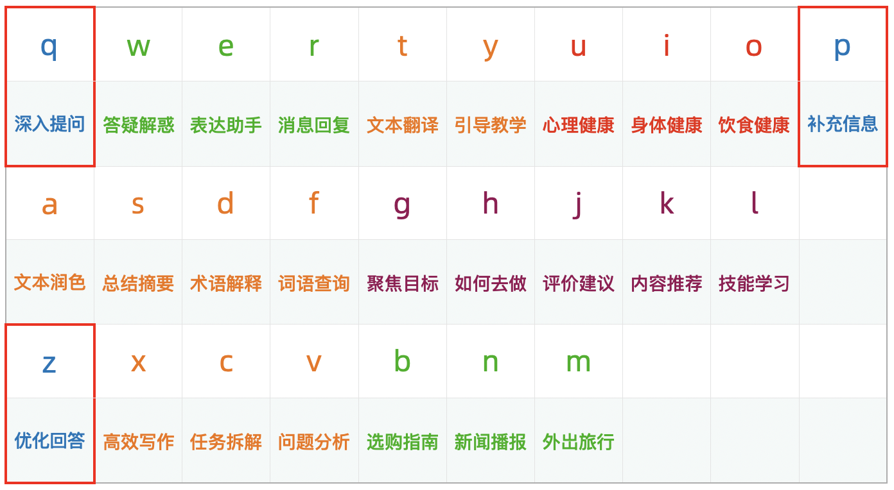

在和AI交流的过程中，你可能会想要了解回答里某个概念的含义，也可能会遇到回答太长的情况，想让AI改短一点。

或者是想补充更多信息，以便得到想要的答复。

这时就轮到 <kbd>q</kbd>、<kbd>z</kbd>、<kbd>p</kbd> 这三个辅助问答键出场了。

<p align="right">
  <a href="#第3章-使用指南">
    
  </a>
</p>

#### 3.4.1 q键的用法

当你想让AI解释或解读回答里的某个概念、词语、句子或段落时，**先**输入一个 <kbd>q</kbd>，**然后**粘贴想进一步提问的内容，**之后**发送即可。

**使用方法如下**：

<details open>

<br>
  
<summary><b>对话模拟8</b></summary>

**发送**：h让自己每天都保持精力充沛

**AI的回复**：每天都保持精力充沛的方法（回答里提到了“**升糖指数**”）。

***快捷键 h对应的提示词是**：我想[]，我应该怎么做？*

**发送**：q升糖指数

**AI的回复**：对“升糖指数”进行了解释说明。

***快捷键 q对应的提示词是**：详细解释或解读以上回答里提到的：[]。*

</details>

---

#### 3.4.2 z键的用法

发送一个 <kbd>z</kbd> 可以让AI将生成的回答改写得简短易懂。

<details open>

<br>
  
<summary><b>对话模拟9</b></summary>

**发送**：ll写作

**AI的回复**：具体的做法，篇幅较长。

***快捷键 ll对应的提示词是**：我想提高自己的[]能力，我应该怎么做？*

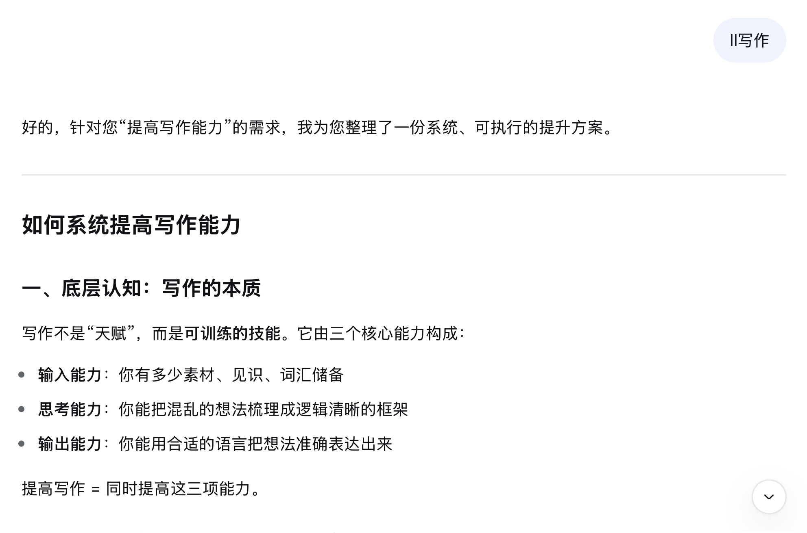

**发送**：z

**AI的回复**：简短易懂的做法。

**使用效果如下**：

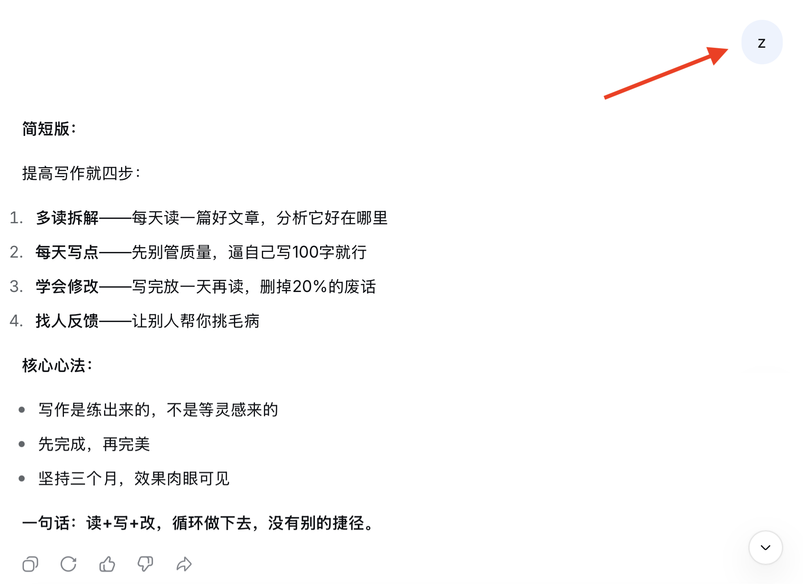

</details>

发送两个 <kbd>z</kbd> 则可以让AI再生成一些相关内容：

<details open>

<br>
  
<summary><b>对话模拟10</b></summary>

**发送**：k小众但评分很高的科幻电影

**AI的回复**：根据你的要求推荐了一些电影，还附带了推荐理由。

***快捷键 k对应的提示词是**：推荐一些[]，附带推荐理由。*

**发送**：zz

**AI的回复**：又推荐了一些电影，还附带了推荐理由。

</details>

✨ ✨ ✨ ✨ ✨ ✨

如果你觉得AI的回答不够完美，可以先发送 <kbd>zc</kbd>，**让AI分析回答里的不足之处并制定改进方案**。

```markdown
zc：分析你回答里的不足之处，并制定详细的改进方案。
```

AI回复后再发送 <kbd>zv</kbd>，**让AI基于改进方案重新生成**。

```markdown
zv：基于以上改进方案进行调整或补充。
```

**具体用法如下**：

<details open>

<br>
  
<summary><b>对话模拟11</b></summary>

**发送**：dqAI发展

**AI的回复**：撰写了一篇关于AI发展的研究报告。

***快捷键 dq对应的提示词是**：撰写一篇关于[]的研究报告。*

**发送**：zc

**AI的回复**：分析了研究报告的不足之处，并制定了详细的改进方案。

**发送**：zv

**AI的回复**：基于改进方案进行了调整或补充。

</details>

---

#### 3.4.3 p键的用法

我最初给 <kbd>p键</kbd> 编写的是制定计划方面的提示词。

之后我意识到只在 <kbd>[]</kbd> 里填写信息不足以完全说明需求。

有时候提出的要求还会和快捷键对应的提示词产生冲突。

以快捷键 <kbd>tt</kbd> 为例，它对应的提示词是“**将以下内容翻译成英语：[]**”。

如果我们在 <kbd>tt</kbd> 后面写了要翻译的内容后还想提其他要求，那么我们的要求也会被放进 <kbd>[]</kbd> 里。

**最后AI可能会把要求也翻译成英语，而不是按照要求翻译**。

于是我把 <kbd>p键</kbd> 的基础功能改成了：

```markdown
p：补充信息或要求如下：[]。
```

<details open>

<br>
  
<summary><b>对话模拟12</b></summary>

**发送**：**tt**帮你轻松享受AI带来的便利，**p**给三个不同的版本

**AI的回复**：将这句话翻译成了英语，并给了三个不同的版本。

**使用效果如下**：

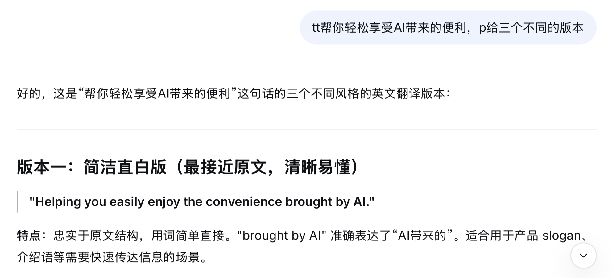

</details>
  
---

### 3.5 带有两个[]提示词的用法

有的提示词里有两个方括号 <kbd>[]</kbd>：

```markdown
yz：如何让[]养成或学会[]。

gg：我在[]的过程中[]，请给我一些指导。
```

使用时输入斜杠 <kbd>/</kbd> 分隔即可。

<details open>

<br>
  
<summary><b>对话模拟13</b></summary>

**发送**：gg实现人生目标/感到迷茫

**AI的回复**：提供了针对性的指导。

</details>

<details open>

<summary><b>点击隐藏或显示使用效果的截图</b></summary>

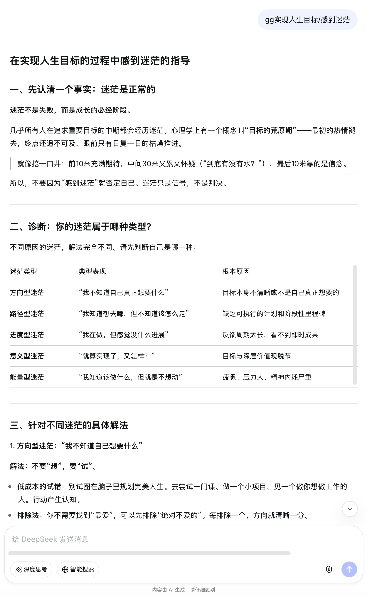

</details>

<p align="right">
  <a href="#第3章-使用指南">
    
  </a>
</p>

---

### 3.6 如何为AI键盘设置新的AI Key

在AI键盘里，提示词的快捷键叫**AI键**（**AI Key**）。

比如 <kbd>a</kbd>、<kbd>aq</kbd>、<kbd>a1</kbd>、<kbd>v1</kbd>。

快捷键和提示词的组合叫**aikey**，比如：

```markdown
mq：生成一份[]的旅行攻略。
```

你可以直接修改我在 AI Key 里预设好的提示词，也可以自定义新的 AI Key，比如 <kbd>go</kbd>、<kbd>lol</kbd>、<kbd>yyds</kbd>。

我推荐用“**字母+数字**”这一格式为AI键盘设置新的 AI Key。

我预设了一些，例如 <kbd>s1</kbd> 是赏析，<kbd>x1</kbd> 是写文章，<kbd>x2</kbd> 是写标题。

现在让我们把 <kbd>x3</kbd> 也设置为 AI Key。

很简单，只需两步：

**第一步**，在“x3”的后面加冒号，即“x3：”。

**第二步**，写具体的提示词，比如让AI生成不同生肖年的新年祝福语。

```markdown
x3：给我一些[]年的新年祝福语。
```

> Tips：建议将新的 aikey 放在对应按键的后面，方便后续查找和调整。

<details open>

<br>
  
<summary><b>对话模拟14</b></summary>

**发送**：x3马

**AI的回复**：生成了一些马年的新年祝福语。

</details>

✨ ✨ ✨ ✨ ✨ ✨

另外，如果你的实体键盘带数字小键盘，那么直接把数字设为 AI Key 会更加方便。

比如把数字 <kbd>1</kbd> 设为 AI Key，功能是搜索并解读AI资讯。

```markdown
1：搜索并解读近期AI领域的热点新闻。
```

<details open>

<br>
  
<summary><b>对话模拟15</b></summary>

**发送**：1

**AI的回复**：近期AI领域的热点新闻和相关解读。

</details>

<p align="right">
  <a href="#第3章-使用指南">
    
  </a>
</p>

---

### 3.7 将AI键盘添加到AI工具里的方法

篇幅原因，我在这里只介绍如何将AI键盘添加到DeepSeek和元宝里。

#### 3.7.1 添加到DeepSeek里的方法

**方法1**

把第2章里的提示词复制到输入框中，然后发送即可。

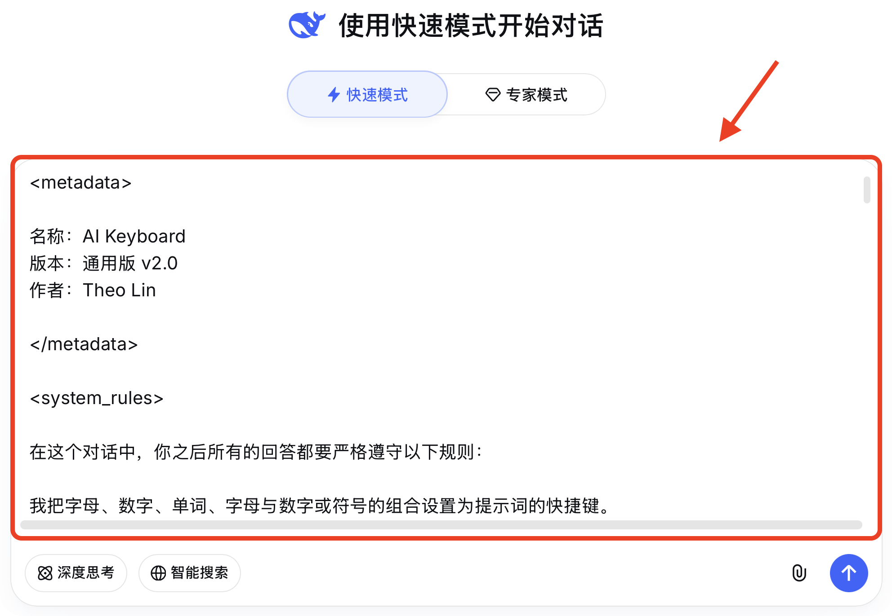

**方法2**

把第2章里的提示词复制到一个文档里，然后上传该文档即可。

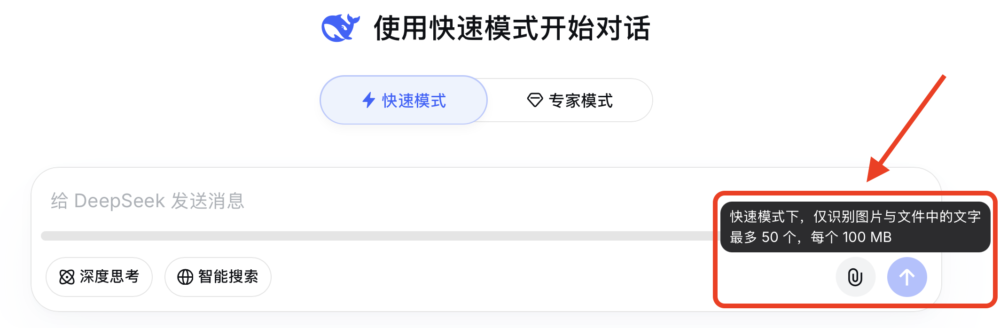

> Tips：建议将发送过AI键盘提示词的对话置顶，方便后续查找和使用。

---

#### 3.7.2 添加到元宝里的方法

**首先**点击侧边栏“分组”右侧的+号：

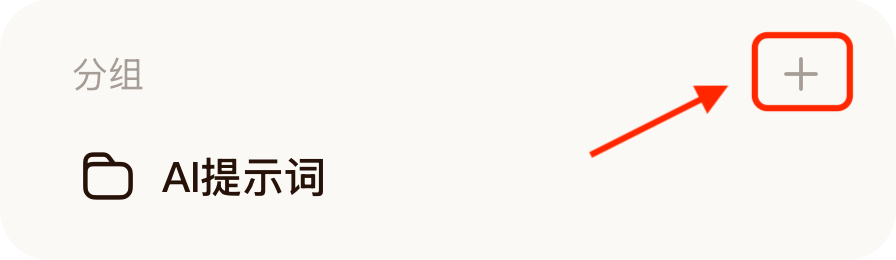

**然后**创建一个新的分组：

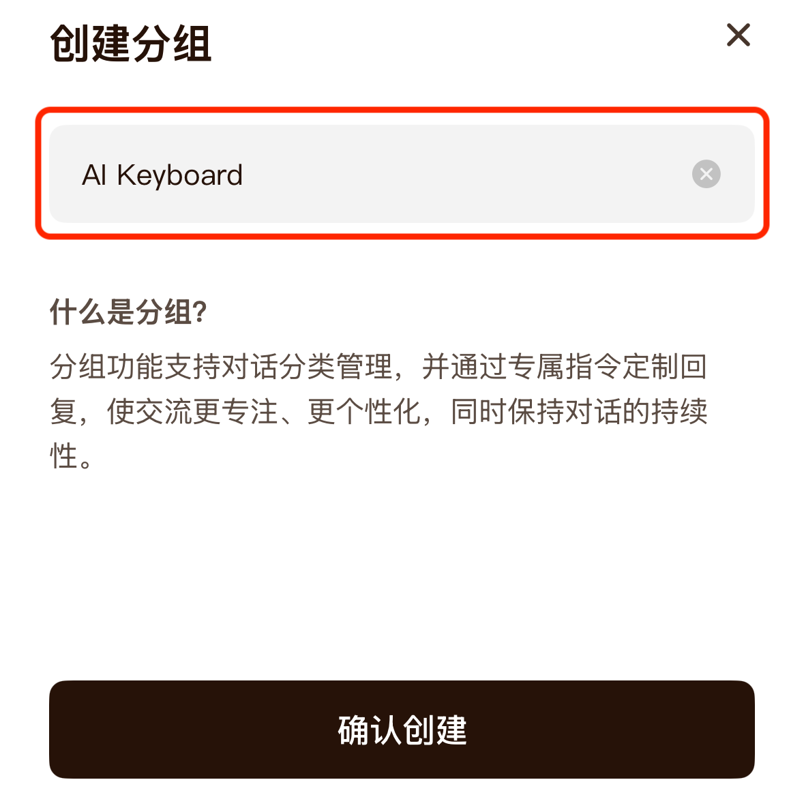

**之后**点击“指令”：

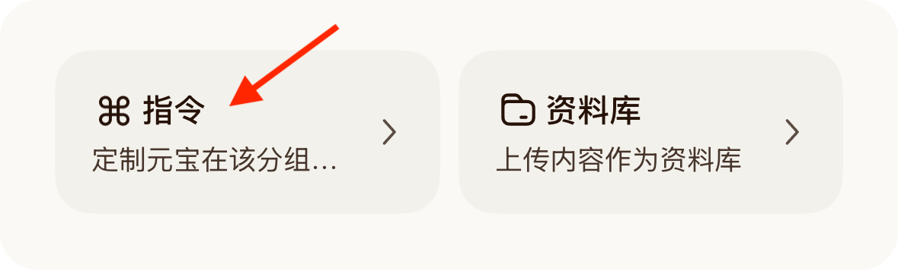

**最后**将第2章里的提示词复制到输入框中并使用：

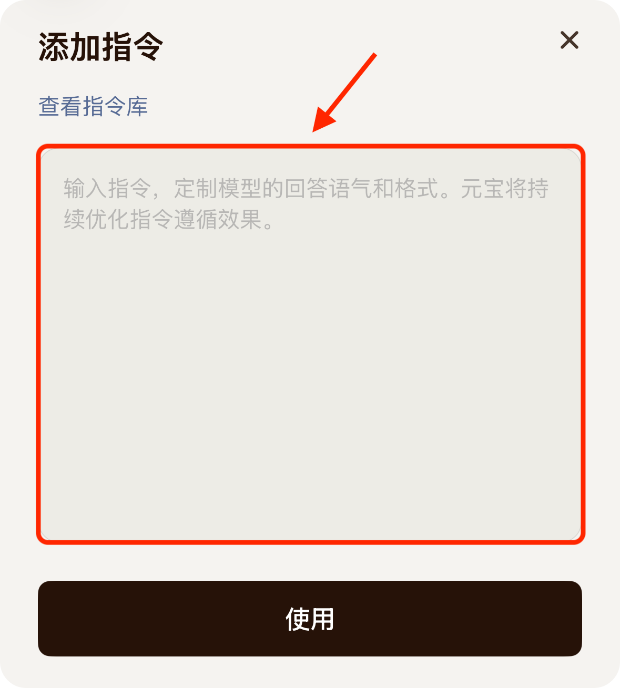

这样就能在这个分组里用AI键盘提问了：

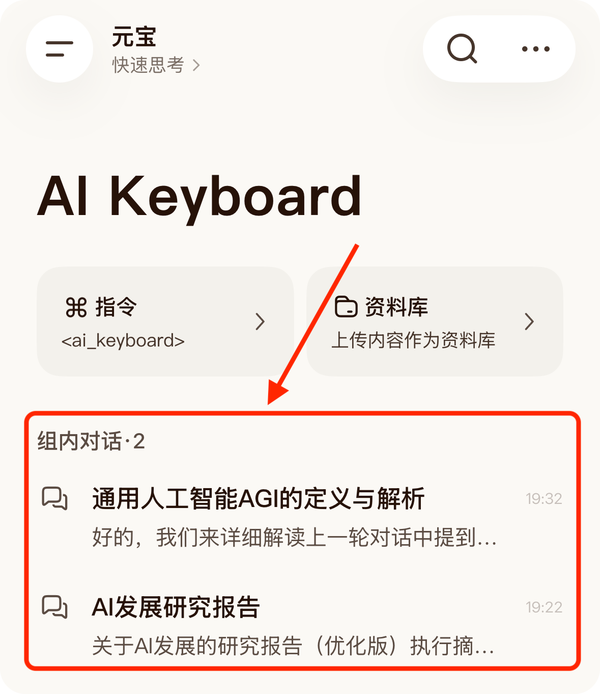

<p align="right">
  <a href="#第3章-使用指南">
    
  </a>
</p>

---

## 第4章 如何记忆按键对应的提示词

我在设计AI键盘的时候有意让`按键上的字母`、`按键对应的提示词`、`由字母联想到的单词或拼音`相互关联。

这样就能用**联想记忆法**记忆了。

比如 <kbd>q键</kbd> 的基础功能是**进一步提问**，那么我们就可以联想到“**question**”这个单词，从而记住 <kbd>q键</kbd> 对应的是关于提问的提示词。

再比如 <kbd>b键</kbd> 的基础功能是**生成购物指南**，和买东西有关，那么我们就可以借助“**buy**”这个单词记住 <kbd>b键</kbd> 对应的一系列提示词。

除了单词外，你还可以根据**拼音的首字母**或**字母的形状**记忆按键对应的提示词。

**具体的记忆方法如下**：

<details open>

<br>
  
<summary><b>第一行按键</b></summary>

<kbd>q</kbd> 是深入提问，对应question。

<kbd>w</kbd> 是答疑解惑，对应why。

<kbd>e</kbd> 是表达助手，对应express。

<kbd>r</kbd> 是消息回复，对应reply。

<kbd>t</kbd> 是文本翻译，对应translate。

<kbd>y</kbd> 是引导教学，对应“引导”或Yoda。

<kbd>u</kbd> 是心理健康，对应unconscious。

<kbd>i</kbd> 是身体健康，对应in good health。

<kbd>o</kbd> 是饮食健康，对应oral，也可以将“o”看作张开的嘴巴。

<kbd>p</kbd> 是补充信息，对应plus。

</details>

<details open>

<br>
  
<summary><b>第二行按键</b></summary>

<kbd>a</kbd> 是文本润色，对应adapt。

<kbd>s</kbd> 是总结摘要，对应sum up。

<kbd>d</kbd> 是术语解释，对应“定义”或define。

<kbd>f</kbd> 是词语查询，对应find。

<kbd>g</kbd> 是聚焦目标，对应goal。

<kbd>h</kbd> 是如何去做，对应how。

<kbd>j</kbd> 是评价建议，对应“建议”或judge。

<kbd>k</kbd> 是内容推荐，对应pick。

<kbd>l</kbd> 是技能学习，对应learn。

</details>

<details open>

<br>
  
<summary><b>第三行按键</b></summary>

<kbd>z</kbd> 是优化回答，对应zapper。

<kbd>x</kbd> 是高效写作，对应“写”，也可以将“x”看作两支交叉的笔。

<kbd>c</kbd> 是任务拆解，对应“拆解”或chunking。

<kbd>v</kbd> 是问题分析，对应view。

<kbd>b</kbd> 是选购指南，对应buy。

<kbd>n</kbd> 是新闻播报，对应news。

<kbd>m</kbd> 是外出旅行，对应map。

</details>

<p align="right">
  <a href="#toc">
    
  </a>
</p>

---

## 第5章 我的创作动机和灵感来源

### 5.1 创作动机

我经常把AI当词典用，比如让AI给我一些形容什么什么的词语，或者让AI解释某个术语的含义。

我还会问AI饮食方面的问题，比如某种食物怎么怎么样了还能吃吗，什么什么饭前吃还是饭后吃比较好。

有问题直接问AI不仅效率高，而且还能在对话里追问。

然而，每次提问前都要重新输入或复制粘贴提示词，这一过程既繁琐又耗时。

**于是我开始思考如何让提示词用起来更加便捷**。

---

### 5.2 灵感来源

我的灵感来源于《英雄联盟》这款游戏。

有一天我**按**键盘上的 <kbd>q</kbd>、<kbd>w</kbd>、<kbd>e</kbd>、<kbd>r</kbd> 施放技能的时候突然想到：

**为什么不把提示词放进键盘上的26个字母里呢？**

**提示词的内容**相当于英雄技能的说明；

**在文本框里输入字母**表示准备施放对应的技能；

**在提示词的[]里补充信息**类似于用移动鼠标的方式调整技能的指示方向；

**按下发送键或回车键**则等同于点击鼠标施放技能。

之后我便开始为键盘上的26个字母编写提示词。

<p align="right">
  <a href="#toc">
    
  </a>
</p>

</details>

---

## 📄 开源协议

该项目采用 **Apache License 2.0** 协议，完全免费开源。

✅ 你可以：

- 按需修改和调整AI键盘

- 在个人或商业项目中使用AI键盘

- 将AI键盘集成到你的工具或应用里

## 🤝 参与贡献

我深知个人的视角和技术栈有限，我期待社区中富有创造力的开发者们参与进来。

让我们一起为 **AI Keyboard** 注入更多的灵感与功能，一起把它打造成一个强大的工具。

你可以通过以下方式参与贡献：

1. **⭐️ 点亮 Star：** 提升本项目的可见度，让更多有需要的人看到。

2.  **📣 帮忙分享：** 如果觉得AI键盘好用，那就快把它分享给你的朋友或同事吧。

3. **💻 反馈建议：** 如果你有好的想法、发现了 Bug，或者希望添加新功能，欢迎提交 Issue 或 PR。

---

## 💬 作者的话

**我愿为理想放手一搏**。

为了完整地实现我对AI键盘的构想，我选择了脱产创作，目前处于靠积蓄支撑的状态。

我投入了大量的时间与精力去设计、改进和调整AI键盘，又熬了很多个夜撰写这份使用指南。

因为我想为你在通用版里**编写尽可能多的提示词和使用场景**，因为我想让你快速上手，进而找到“**让提示词触手可及**”的感觉。

## ☕️ 支持与赞赏

虽然为爱发电很酷，但维持这种脱产创作的状态确实面临着不小的经济压力。

如果你愿意成为我的“天使投资人”，欢迎请我喝杯咖啡或者请我吃顿晚餐。

你的每一份支持都是在帮我延长这条独立开发的生命线，让我更有底气，也能更自由地继续创作下去。

<table border="0">
  <tr>
    <td align="center">
      <br>
      
    </td>
    <td align="center">
     <br>
     <a href="https://ko-fi.com/theolin" target="_blank">
        
      </a>
    </td>
  </tr>
</table>

## 🌟 赞赏者名单

请在备注中留下你的 **GitHub ID 或昵称**。

无论金额多少，我都会将你列入下方的赞赏者名单，以感谢你的支持。

| 🌟 赞赏者 | 📅 日期 |
| :---: | :---: |
| **虚位以待** | *coming soon* |
| **虚位以待**  | *coming soon* |
| **虚位以待** | *coming soon* |

## ✍️ 写在最后

最后，我要用我给我的公众号想的标语收尾：

Just AI it，大胆去AI吧。

---

<div align="center">
  
  **Made with ❤️ by Theo Lin**
  
  *May the spirit of open source be with you. Happy coding! <a href="#top" style="text-decoration: none;" title="回到顶部">🚀</a>*
  
</div>